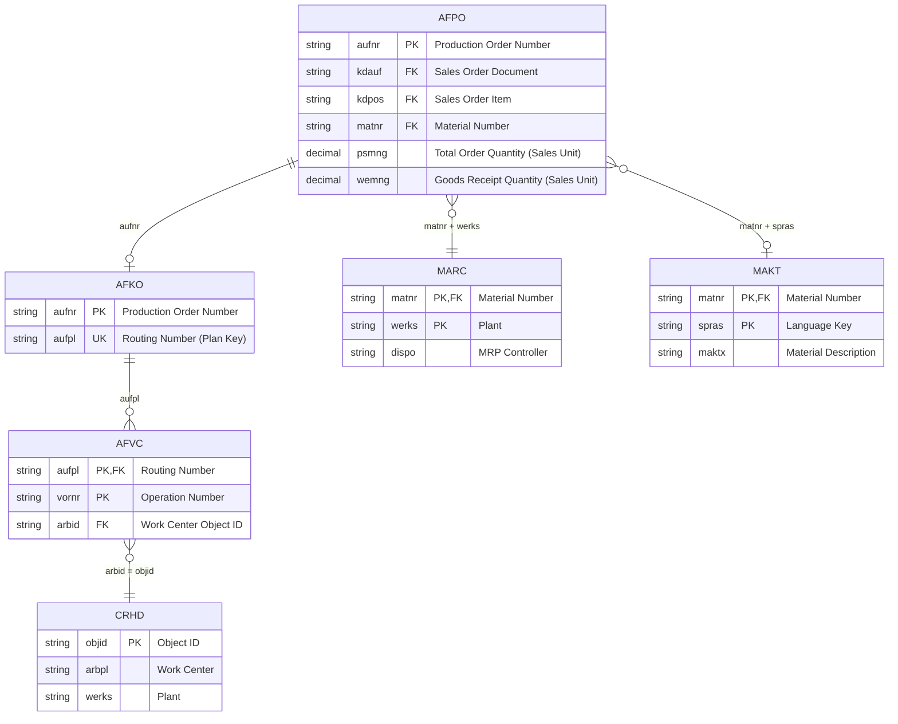
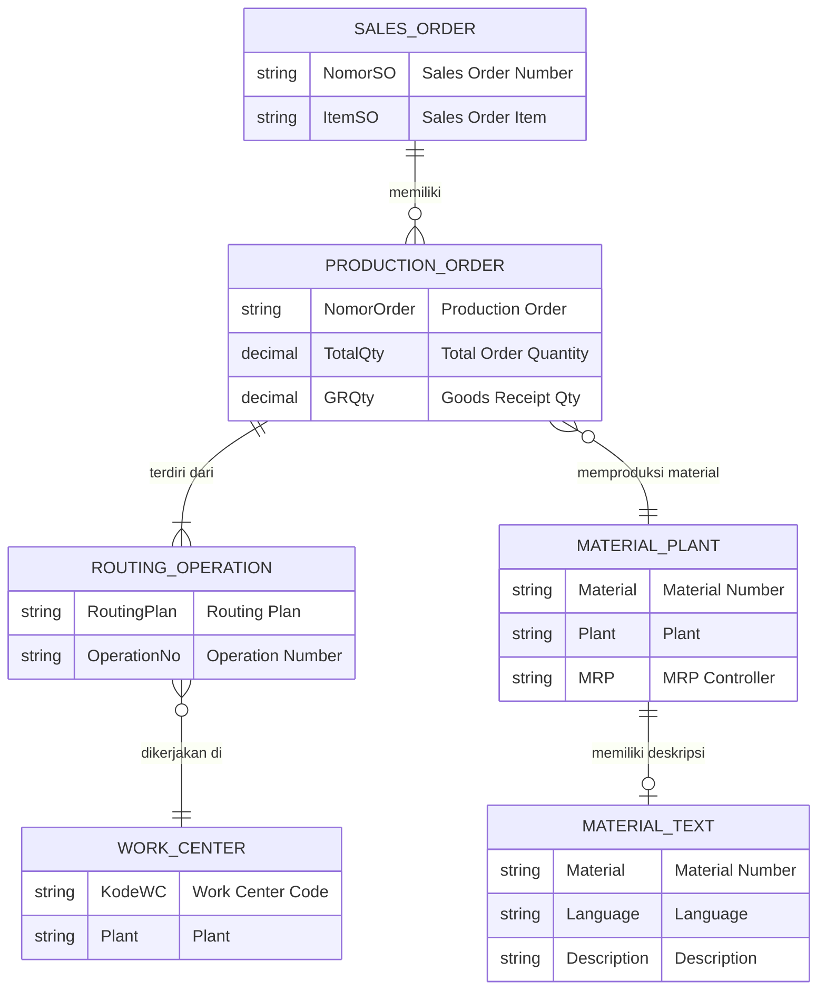
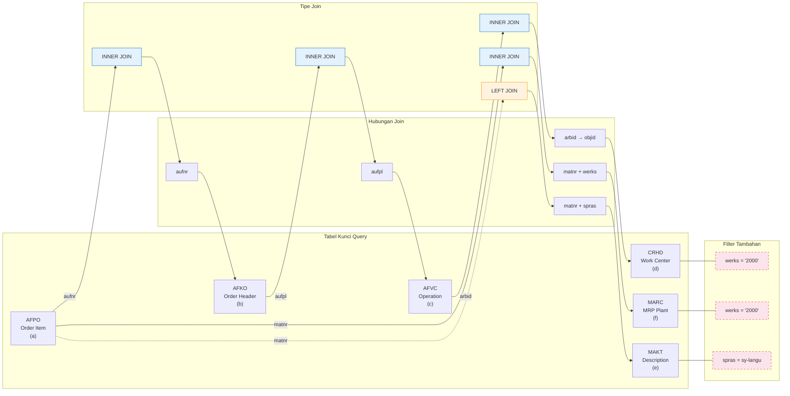
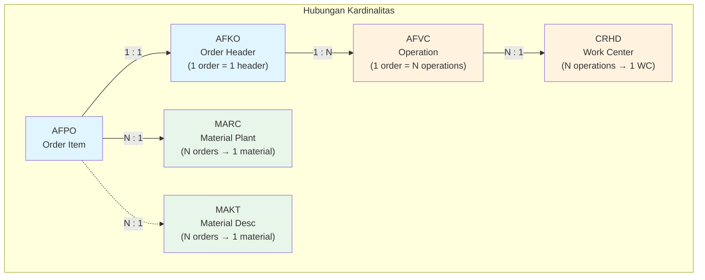
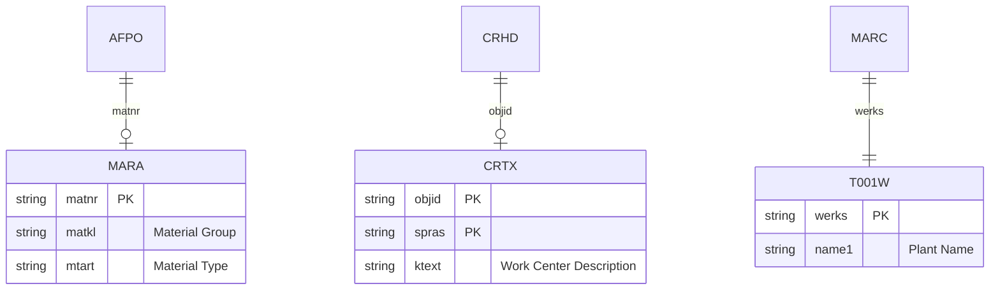
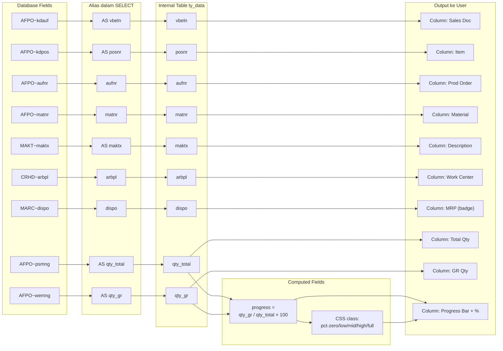

# Entity Relationship Diagram — Monitoring Production (Central Storage)

> Diagram relasi antar tabel SAP yang digunakan dalam sistem monitoring produksi  
> Berdasarkan query dari BSP Application (`main.htm`) dan ABAP Report (`ZMON_CNC_KMI2`)

---

## Daftar Isi

1. [ERD Utama (Mermaid)](#1-erd-utama-mermaid)
2. [ERD FISIK — Semua Kolom](#2-erd-fisik--semua-kolom)
3. [ERD KONSEPTUAL](#3-erd-konseptual)
4. [Relasi Join Visual](#4-relasi-join-visual)
5. [Deskripsi Entity Detail](#5-deskripsi-entity-detail)
6. [Primary & Foreign Keys](#6-primary--foreign-keys)
7. [Index & Performa](#7-index--performa)
8. [Cardinalities](#8-cardinalities)
9. [Data Dictionary (Domain & Data Element)](#9-data-dictionary-domain--data-element)
10. [Sample Data](#10-sample-data)
11. [Tabel Lain yang Relevan](#11-tabel-lain-yang-relevan)
12. [Field Mapping — Query ke Output](#12-field-mapping--query-ke-output)
13. [Join Matrix](#13-join-matrix)

---

## 1. ERD Utama (Mermaid)



---

## 2. ERD FISIK — Semua Kolom

```mermaid
erDiagram
  AFPO {
    mandt    "Client                           " PK
    aufnr    "Order Number                     " PK
    kdauf    "Sales Order Number               "
    kdpos    "Sales Order Item                 "
    matnr    "Material Number                  "
    psmng    "Total qty in sales units         "
    wemng    "Quantity of goods received       "
    meins    "Base Unit of Measure             "
    erfdat   "Date created                     "
    plnbez   "Purchase requisition             "
    vertl    "Distribution                     "
    charg    "Batch Number                     "
    sobkz    "Special Stock Indicator          "
    lgort_s  "Storage Location                 "
    werks    "Plant                            "
  }

  AFKO {
    mandt    "Client                           " PK
    aufnr    "Order Number                     " PK
    aufpl    "Routing number of operations     "
    auart    "Order Type                       "
    gstrp    "Basic start date                 "
    gltrp    "Basic finish date                "
    getri    "Confirmed release date           "
    gmein    "Unit of measure for total qty    "
    werks    "Plant                            "
  }

  AFVC {
    mandt    "Client                           " PK
    aufpl    "Routing number of operations     " PK
    vornr    "Operation Number                 " PK
    arbid    "Work center object ID            "
    werks    "Plant                            "
    steus    "Control key                      "
    ltxa1    "Operation short text             "
    arbeh    "Unit for work                    "
    vgw01    "Operation standard value 1       "
    vgw02    "Operation standard value 2       "
  }

  CRHD {
    mandt    "Client                           " PK
    objid    "Object ID                        " PK
    arbpl    "Work center                      "
    werks    "Plant                            "
    begda    "Start date                       "
    endda    "End date                         "
  }

  MARC {
    mandt    "Client                           " PK
    matnr    "Material Number                  " PK
    werks    "Plant                            " PK
    dispo    "MRP Controller                   "
    dismm    "MRP Type                         "
    beskz    "Procurement Type                 "
    eisbe    "Safety Stock                     "
    ekgrp    "Purchasing Group                 "
    maktx    "(via MAKT join)                  "
  }

  MAKT {
    mandt    "Client                           " PK
    matnr    "Material Number                  " PK
    spras    "Language Key                     " PK
    maktx    "Material Description             "
    maktg    "Material description in uppercase"
  }
```

### Highlight: Kolom yang Digunakan dalam Query

| Tabel | Kolom Digunakan | Tujuan |
|-------|-----------------|--------|
| AFPO | `kdauf`, `kdpos`, `aufnr`, `matnr`, `psmng`, `wemng` | Data utama produksi |
| AFKO | `aufnr`, `aufpl` | Join ke routing |
| AFVC | `aufpl`, `arbid` | Join ke work center |
| CRHD | `objid`, `arbpl`, `werks` | Work center (output + filter) |
| MARC | `matnr`, `werks`, `dispo` | MRP controller (output + filter) |
| MAKT | `matnr`, `spras`, `maktx` | Material description (output) |

---

## 3. ERD KONSEPTUAL



---

## 4. Relasi Join Visual



### Visualisasi Data Flow Join

```
         AFPO (a)
    ┌─────────────────┐
    │ kdauf  (SO Doc) │ ← Input dari user
    │ kdpos  (SO Item)│ ← Input dari user
    │ aufnr  (PK)     │──────→ AFKO (b)
    │ matnr           │──┬────→ MARC (f)  [matnr + werks]
    │ psmng (Total)   │  │───→ MAKT (e)  [matnr + spras] (LEFT)
    │ wemng (GR)      │  │
    └─────────────────┘  │
                         │
                    AFKO (b)
              ┌──────────────────┐
              │ aufnr (PK)       │ ← dari AFPO
              │ aufpl            │──────→ AFVC (c)
              └──────────────────┘
                         │
                    AFVC (c)
              ┌──────────────────┐
              │ aufpl (PK)       │ ← dari AFKO
              │ vornr (PK)       │
              │ arbid (Work Ctr) │──────→ CRHD (d)
              └──────────────────┘
                         │
                    CRHD (d)
              ┌──────────────────┐
              │ objid (PK)       │ ← dari AFVC
              │ arbpl (WC Code)  │ → Output ke user
              │ werks (Plant)    │ → Filter = '2000'
              └──────────────────┘

    MARC (f)              MAKT (e)
    ┌────────────┐        ┌────────────┐
    │ matnr (PK) │        │ matnr (PK) │
    │ werks (PK) │        │ spras (PK) │
    │ dispo      │──→ Out │ maktx      │──→ Out
    └────────────┘        └────────────┘
         ↑                     ↑
         └─────────┬───────────┘
                   │
              AFPO.matnr
```

---

## 5. Deskripsi Entity Detail

### 5.1 AFPO — Production Order Item

| Atribut | Detail |
|----------|--------|
| **Nama Lengkap** | `AFPO` — Order item |
| **Module** | PP (Production Planning) |
| **Fungsi** | Menyimpan data item untuk setiap production order: material, quantity, referensi sales order, goods receipt |
| **Cluster** | 1 order (AFKO) : N items (AFPO) secara konsep, tapi di sistem SAP: AFPO ~1:1 dengan AFKO untuk process/order |
| **Volume Data** | 1 baris per production order untuk manufaktur diskrit |
| **Retensi** | Sesuai archiving object `PP_ORDER` |
| **Digunakan untuk** | Mendapatkan sales order ref, qty order, qty GR |

### 5.2 AFKO — Production Order Header

| Atribut | Detail |
|----------|--------|
| **Nama Lengkap** | `AFKO` — Order header for PP orders |
| **Module** | PP (Production Planning) |
| **Fungsi** | Header data production order: dates, type, routing key, quantity |
| **Key** | `aufnr` — Order Number |
| **Digunakan untuk** | Mendapatkan routing plan key (`aufpl`) untuk join ke AFVC |

### 5.3 AFVC — Operation within Order

| Atribut | Detail |
|----------|--------|
| **Nama Lengkap** | `AFVC` — Operation within order |
| **Module** | PP (Production Planning) |
| **Fungsi** | Menyimpan data operation/routing untuk setiap production order, termasuk work center assignment |
| **Key Composite** | `aufpl` (routing plan) + `vornr` (operation number) |
| **Multi Operation** | 1 production order bisa punya banyak operation (multi-step routing) |
| **Digunakan untuk** | Link dari AFKO ke CRHD (work center) |

### 5.4 CRHD — Work Center

| Atribut | Detail |
|----------|--------|
| **Nama Lengkap** | `CRHD` — Work Center Header |
| **Module** | PP (Production Planning) / Cross-Application |
| **Fungsi** | Master data work center: kode, plant, deskripsi, validitas |
| **Key** | `objid` — Object ID (numeric 8 digit) |
| **Digunakan untuk** | Mendapatkan kode work center (`arbpl`) dan filter plant |

### 5.5 MARC — Plant Material Data

| Atribut | Detail |
|----------|--------|
| **Nama Lengkap** | `MARC` — Plant Data for Material |
| **Module** | LO (Logistics) / PP |
| **Fungsi** | Data material per plant: MRP, purchasing, forecasting |
| **Key Composite** | `matnr` + `werks` |
| **Digunakan untuk** | Mendapatkan MRP Controller (`dispo`) |

### 5.6 MAKT — Material Description

| Atribut | Detail |
|----------|--------|
| **Nama Lengkap** | `MAKT` — Material Descriptions |
| **Module** | LO (Logistics) |
| **Fungsi** | Teks deskripsi material dalam berbagai bahasa |
| **Key Composite** | `matnr` + `spras` |
| **Digunakan untuk** | Mendapatkan nama/deskripsi material (`maktx`) dalam bahasa user |

---

## 6. Primary & Foreign Keys

### Primary Keys

| Tabel | Primary Key | Tipe Data | Panjang | Deskripsi |
|-------|-------------|-----------|---------|-----------|
| AFPO | `mandt` + `aufnr` | CLNT + CHAR | 3 + 12 | Client + Order Number |
| AFKO | `mandt` + `aufnr` | CLNT + CHAR | 3 + 12 | Client + Order Number |
| AFVC | `mandt` + `aufpl` + `vornr` | CLNT + NUMC + CHAR | 3 + 12 + 4 | Client + Plan + Operation |
| CRHD | `mandt` + `objid` | CLNT + NUMC | 3 + 8 | Client + Object ID |
| MARC | `mandt` + `matnr` + `werks` | CLNT + CHAR + CHAR | 3 + 40 + 4 | Client + Material + Plant |
| MAKT | `mandt` + `matnr` + `spras` | CLNT + CHAR + LANG | 3 + 40 + 1 | Client + Material + Language |

### Foreign Key Relationships

| Tabel Child | FK Field | Tabel Parent | Parent Field | Join Type di Query |
|-------------|----------|-------------|--------------|-------------------|
| AFPO | `aufnr` | AFKO | `aufnr` | INNER JOIN |
| AFKO | `aufpl` | AFVC | `aufpl` | INNER JOIN |
| AFVC | `arbid` | CRHD | `objid` | INNER JOIN |
| AFPO | `matnr` | MARC | `matnr` | INNER JOIN |
| MARC | `matnr` | MAKT | `matnr` | LEFT JOIN |

### Foreign Keys (SAP Standard)

```
AFPO
  └─ aufnr → AFKO (Foreign Key)
  └─ matnr → MARA (Material Master)

AFKO
  └─ aufnr → AFPO (Foreign Key)
  └─ aufpl → AFVC (via plan key)

AFVC
  └─ aufpl → AFKO (Foreign Key)
  └─ arbid → CRHD (Object ID)

CRHD
  └─ (standalone master data, no mandatory FK to other tables here)

MARC
  └─ matnr → MARA (Material Master)
  └─ werks → T001W (Plant Master)

MAKT
  └─ matnr → MARA (Material Master)
  └─ spras → T002 (Language)
```

---

## 7. Index & Performa

### Primary Indexes

| Tabel | Index Name | Fields | Type |
|-------|-----------|--------|------|
| AFPO | AFPO~0 | `mandt`, `aufnr` | UNIQUE (Primary) |
| AFKO | AFKO~0 | `mandt`, `aufnr` | UNIQUE (Primary) |
| AFVC | AFVC~0 | `mandt`, `aufpl`, `vornr` | UNIQUE (Primary) |
| CRHD | CRHD~0 | `mandt`, `objid` | UNIQUE (Primary) |
| MARC | MARC~0 | `mandt`, `matnr`, `werks` | UNIQUE (Primary) |
| MAKT | MAKT~0 | `mandt`, `matnr`, `spras` | UNIQUE (Primary) |

### Secondary Indexes yang Relevan

| Tabel | Index Name | Fields | Keterangan |
|-------|-----------|--------|-----------|
| AFPO | AFPO~A | `kdauf`, `kdpos` | **Sangat relevan** — WHERE clause menggunakan field ini |
| AFPO | AFPO~B | `matnr` | Relevan untuk join ke MARC/MAKT |
| AFKO | AFKO~B | `aufpl` | Relevan untuk join ke AFVC |
| AFVC | AFVC~C | `arbid` | Relevan untuk join ke CRHD |
| MARC | MARC~B | `dispo` | Kurang relevan untuk query ini |
| MAKT | MAKT~B | `spras` | Relevan untuk filter bahasa |

### Rekomendasi Index

| Tujuan | Index | Keterangan |
|--------|-------|-----------|
| **Optimasi WHERE utama** | AFPO~A (`kdauf`, `kdpos`) | Filter sales order + item — index ini KRUSIAL |
| **Covering index** | AFPO~A + `psmng`, `wemng` | Include column agar tidak perlu table access |
| **Join MARC** | MARC~0 sudah cukup | PK (matnr+werks) langsung |
| **Join CRHD** | CRHD~0 sudah cukup | PK (objid) langsung |

> **Catatan:** Jika AFPO~A tidak ada, query akan melakukan FULL TABLE SCAN pada AFPO.  
> Cek keberadaan index via SE14 atau SE11.

---

## 8. Cardinalities

### Diagram Kardinalitas Lengkap



### Tabel Kardinalitas

| Dari | Ke | Kardinalitas | Penjelasan | Dampak Query |
|------|----|-------------|-----------|-------------|
| **AFPO** | **AFKO** | 1:1 | Setiap production order memiliki 1 header | Join menghasilkan 1 baris |
| **AFKO** | **AFVC** | 1:N | 1 order bisa memiliki banyak operation (multi-step routing) | **Multiplication** — 1 order bisa muncul N kali, sekali per operation |
| **AFVC** | **CRHD** | N:1 | Banyak operation bisa merujuk ke 1 work center | Tidak menggandakan data |
| **AFPO** | **MARC** | N:1 | Banyak production order bisa untuk material yang sama di plant yang sama | Tidak menggandakan data |
| **AFPO** | **MAKT** | N:1 | Banyak material bisa memiliki deskripsi yang sama (LEFT JOIN) | Tidak menggandakan data |

### Implikasi Kardinalitas AFKO : AFVC = 1:N

```
Contoh:
Production Order 1000001
├── Operation 0010 → Work Center WC-ASSY
├── Operation 0020 → Work Center WC-TEST
└── Operation 0030 → Work Center WC-PACK

Hasil query akan menampilkan 3 baris untuk 1 production order,
masing-masing dengan work center berbeda.
```

### Tabel Multiplikasi dalam Query

```
AFPO (1) → AFKO (1) → AFVC (N operations)
                          │
                          ├── CRHD (1) → arbpl = WC-001
                          │
AFPO (1) → MARC (1) → dispo = MRP1
AFPO (1) → MAKT (1) → maktx = "Material A"

→ Hasil: N baris (sejumlah operation), semua field lain sama
  kecuali arbpl (work center berbeda per operation)
```

---

## 9. Data Dictionary (Domain & Data Element)

### Domain SAP

| Field | Domain | Data Type | Length | Decimals | Output Length | Deskripsi |
|-------|--------|-----------|--------|----------|--------------|-----------|
| `aufnr` | `AUFNR` | CHAR | 12 | 0 | 12 | Order Number |
| `kdauf` | `VBELN` | CHAR | 10 | 0 | 10 | Sales Document |
| `kdpos` | `POSNR` | NUMC | 6 | 0 | 6 | Item Number |
| `matnr` | `MATNR` | CHAR | 40 | 0 | 18 | Material Number |
| `psmng` | `MENG13` | QUAN | 13 | 3 | 13 | Total Quantity |
| `wemng` | `MENG13` | QUAN | 13 | 3 | 13 | GR Quantity |
| `arbpl` | `ARBPL` | CHAR | 8 | 0 | 8 | Work Center |
| `werks` | `WERKS` | CHAR | 4 | 0 | 4 | Plant |
| `dispo` | `DISPO` | CHAR | 3 | 0 | 3 | MRP Controller |
| `maktx` | `MAKTX` | CHAR | 40 | 0 | 40 | Material Desc |
| `aufpl` | `AUFPL` | NUMC | 12 | 0 | 12 | Routing Plan |
| `vornr` | `VORNR` | CHAR | 4 | 0 | 4 | Operation No |
| `arbid` | `CR_OBJID` | NUMC | 8 | 0 | 8 | Object ID |
| `objid` | `CR_OBJID` | NUMC | 8 | 0 | 8 | Object ID |
| `spras` | `SPRAS` | LANG | 1 | 0 | 1 | Language Key |

### Data Element SAP

| Field | Data Element | Domain | Deskripsi Singkat |
|-------|-------------|--------|-------------------|
| `aufnr` | `AUFNR` | AUFNR | Order Number |
| `kdauf` | `VBELN_VA` | VBELN | Sales Document |
| `kdpos` | `POSNR_VA` | POSNR | Sales Item |
| `matnr` | `MATNR` | MATNR | Material |
| `psmng` | `PSMNG` | MENG13 | Total Order Qty |
| `wemng` | `WEMNG` | MENG13 | Goods Receipt Qty |
| `arbpl` | `ARBPL` | ARBPL | Work Center |
| `werks` | `WERKS_D` | WERKS | Plant |
| `dispo` | `DISPO` | DISPO | MRP Controller |
| `maktx` | `MAKTX` | MAKTX | Material Description |
| `aufpl` | `CO_AUFPL` | AUFPL | Routing Plan |
| `vornr` | `VORNR` | VORNR | Operation Number |
| `arbid` | `CR_OBJID` | CR_OBJID | Object ID |
| `objid` | `CR_OBJID` | CR_OBJID | Object ID |

### Catatan Khusus

| Domain | Catatan |
|--------|---------|
| `MENG13` | Quantity type — perlu unit of measure dari field `meins` (AFPO) atau `gmein` (AFKO) untuk konteks penuh. Tapi di query tidak diambil. |
| `MATNR` | CHAR 40 dengan display length 18 — bisa berisi leading zeros |
| `CR_OBJID` | NUMC 8 — dijadikan foreign key dari `arbid` ke `objid` |
| `VBELN` | CHAR 10 — Sales Document Number (alphanumeric, biasanya numeric) |

---

## 10. Sample Data

### Data Fiktif untuk Ilustrasi

**AFPO**

| MANDT | AUFNR | KDAUF | KDPOS | MATNR | PSMNG | WEMNG |
|-------|-------|-------|-------|-------|-------|-------|
| 100 | 10000001 | 4500001234 | 000010 | MAT-001 | 100.000 | 75.000 |
| 100 | 10000002 | 4500001234 | 000010 | MAT-001 | 100.000 | 100.000 |
| 100 | 10000003 | 4500001234 | 000020 | MAT-002 | 50.000 | 0.000 |

**AFKO**

| MANDT | AUFNR | AUFPL | AUART |
|-------|-------|-------|-------|
| 100 | 10000001 | 50000001 | PP01 |
| 100 | 10000002 | 50000002 | PP01 |
| 100 | 10000003 | 50000003 | PP01 |

**AFVC**

| MANDT | AUFPL | VORNR | ARBID |
|-------|-------|-------|-------|
| 100 | 50000001 | 0010 | 100001 |
| 100 | 50000001 | 0020 | 100002 |
| 100 | 50000001 | 0030 | 100003 |
| 100 | 50000002 | 0010 | 100001 |
| 100 | 50000003 | 0010 | 100002 |

**CRHD**

| MANDT | OBJID | ARBPL | WERKS |
|-------|-------|-------|-------|
| 100 | 100001 | WC-ASSY | 2000 |
| 100 | 100002 | WC-TEST | 2000 |
| 100 | 100003 | WC-PACK | 2000 |

**MARC**

| MANDT | MATNR | WERKS | DISPO |
|-------|-------|-------|-------|
| 100 | MAT-001 | 2000 | MRP1 |
| 100 | MAT-002 | 2000 | MRP2 |

**MAKT**

| MANDT | MATNR | SPRAS | MAKTX |
|-------|-------|-------|-------|
| 100 | MAT-001 | E | Brake Pad Set |
| 100 | MAT-001 | I | Kit Pastiglie Freno |
| 100 | MAT-002 | E | Oil Filter |

### Hasil Query untuk SO 4500001234 / Item 000010

| VBELN | POSNR | AUFNR | MATNR | MAKTX | ARBPL | DISPO | QTY_TOTAL | QTY_GR | Progress |
|-------|-------|-------|-------|-------|-------|-------|-----------|--------|----------|
| 4500001234 | 000010 | 10000001 | MAT-001 | Brake Pad Set | WC-ASSY | MRP1 | 100 | 75 | 75.00% |
| 4500001234 | 000010 | 10000001 | MAT-001 | Brake Pad Set | WC-TEST | MRP1 | 100 | 75 | 75.00% |
| 4500001234 | 000010 | 10000001 | MAT-001 | Brake Pad Set | WC-PACK | MRP1 | 100 | 75 | 75.00% |
| 4500001234 | 000010 | 10000002 | MAT-001 | Brake Pad Set | WC-ASSY | MRP1 | 100 | 100 | 100.00% |

> **Catatan:** 1 order (10000001) dengan 3 operation → output 3 baris,  
> progress sama karena dihitung dari AFPO (order level), bukan per operation.

---

## 11. Tabel Lain yang Relevan

### Tabel yang Tidak Digunakan Tapi Relevan

| Tabel | Deskripsi | Kenapa Tidak Digunakan | Potensi Pengembangan |
|-------|-----------|------------------------|---------------------|
| **MARA** | Material Master | Tidak perlu untuk query saat ini | Bisa untuk `matkl` (material group), `mbrsh`, `mtart` |
| **T001W** | Plant Master | Filter plant hardcoded 2000 | Bisa untuk nama plant |
| **AFRU** | Confirmation data (actual qty) | Menggunakan `wemng` dari AFPO | Untuk progress real-time per operation |
| **AFVV** | Operation quantity | Tidak perlu | Untuk planned qty per operation |
| **KAKO** | Capacity header | Tidak perlu | Untuk detail capacity WC |
| **CRTX** | Work Center text | Tidak ada join | Untuk deskripsi work center |
| **TCODE** | Task list header | Tidak perlu | Untuk alternative routing |

### Tabel untuk Development Kedepan



---

## 12. Field Mapping — Query ke Output

### Mapping Lengkap



### Output HTML Reference (BSP)

| Kolom | HTML Element | CSS Class | Data Attribute |
|-------|-------------|-----------|---------------|
| Sales Doc | `<td>` | `col-vbeln` | - |
| Item | `<td>` | `center` | - |
| Production Order | `<td>` | `col-aufnr` | - |
| Material | `<td>` | `col-matnr` | - |
| Description | `<td>` | `col-desc` | - |
| Work Center | `<td>` | `col-wc` | `data-wc` |
| MRP | `<td>` → `<span>` | `col-mrp` → `mrp-badge` | `data-mrp` |
| Total Qty | `<td>` | `col-qty` | - |
| GR Qty | `<td>` | `col-qty` | - |
| Progress | `<div>` bar + `<span>` % | `progress-wrap` → dll | - |

---

## 13. Join Matrix

### Matrix Tabel 6×6

| | AFPO | AFKO | AFVC | CRHD | MARC | MAKT |
|---|---|---|---|---|---|---|
| **AFPO** | - | `aufnr` INNER | - | - | `matnr + werks` INNER | `matnr + spras` LEFT |
| **AFKO** | `aufnr` INNER | - | `aufpl` INNER | - | - | - |
| **AFVC** | - | `aufpl` INNER | - | `arbid = objid` INNER | - | - |
| **CRHD** | - | - | `arbid = objid` INNER | - | - | - |
| **MARC** | `matnr + werks` INNER | - | - | - | - | - |
| **MAKT** | `matnr + spras` LEFT | - | - | - | - | - |

### Join Path

```
Shortest path dari AFPO ke setiap tabel:
AFPO → AFKO     : 1 hop  (aufnr)
AFPO → AFVC     : 2 hops (aufnr → aufpl)
AFPO → CRHD     : 3 hops (aufnr → aufpl → arbid)
AFPO → MARC     : 1 hop  (matnr + werks)
AFPO → MAKT     : 1 hop  (matnr + spras)
```

### SQL Execution Order Estimation

```
1. Filter AFPO: WHERE kdauf = X AND kdpos = Y
2. JOIN AFKO pada aufnr (1:1)
3. JOIN AFVC pada aufpl (1:N → multiplikasi)
4. JOIN CRHD pada arbid (N:1)
5. JOIN MARC pada matnr + werks (N:1)
6. LEFT JOIN MAKT pada matnr + spras (N:1)
7. SELECT fields
8. INTO internal table
```

---

## Index Diagram

| Diagram | Halaman | Deskripsi |
|---------|---------|-----------|
| 1 | [ERD Utama](#1-erd-utama-mermaid) | Diagram ERD Mermaid dengan PK/FK |
| 2 | [ERD Fisik](#2-erd-fisik--semua-kolom) | Semua kolom dari 6 tabel |
| 3 | [ERD Konseptual](#3-erd-konseptual) | Model konseptual bisnis |
| 4 | [Relasi Join](#4-relasi-join-visual) | Visual join path + tipe join |
| 5 | [Entity Detail](#5-deskripsi-entity-detail) | Deskripsi per tabel lengkap |
| 6 | [Primary & Foreign Keys](#6-primary--foreign-keys) | Semua PK dan FK |
| 7 | [Index](#7-index--performa) | Index, performa, rekomendasi |
| 8 | [Cardinalities](#8-cardinalities) | Kardinalitas antar tabel |
| 9 | [Data Dictionary](#9-data-dictionary-domain--data-element) | Domain + Data Element SAP |
| 10 | [Sample Data](#10-sample-data) | Data fiktif + contoh hasil query |
| 11 | [Tabel Relevan](#11-tabel-lain-yang-relevan) | Tabel lain untuk pengembangan |
| 12 | [Field Mapping](#12-field-mapping--query-ke-output) | Mapping field DB → output user |
| 13 | [Join Matrix](#13-join-matrix) | Matrix join 6 tabel |
