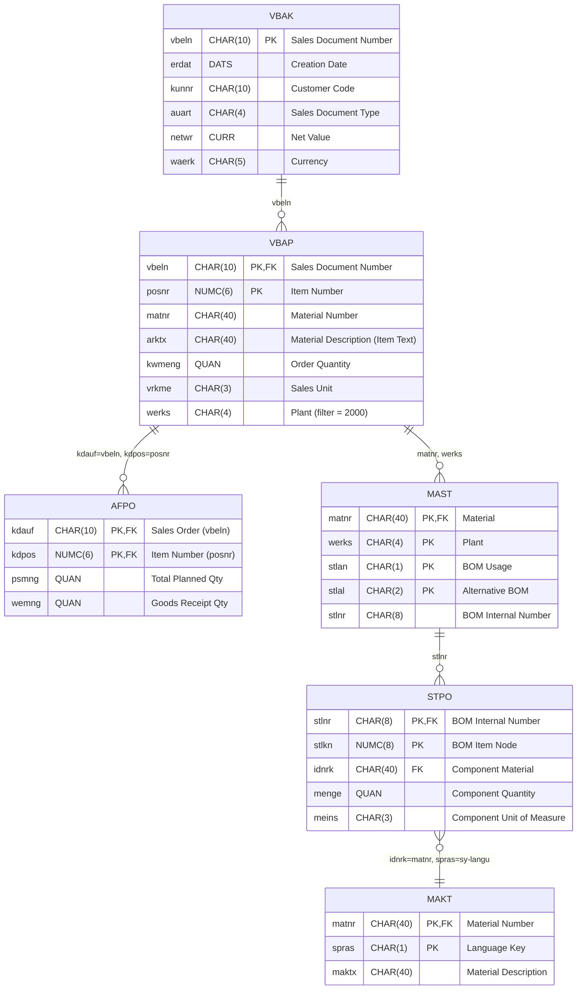
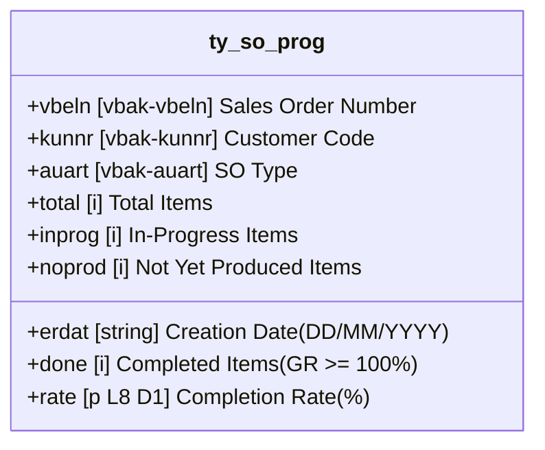
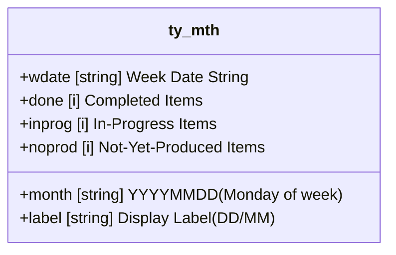
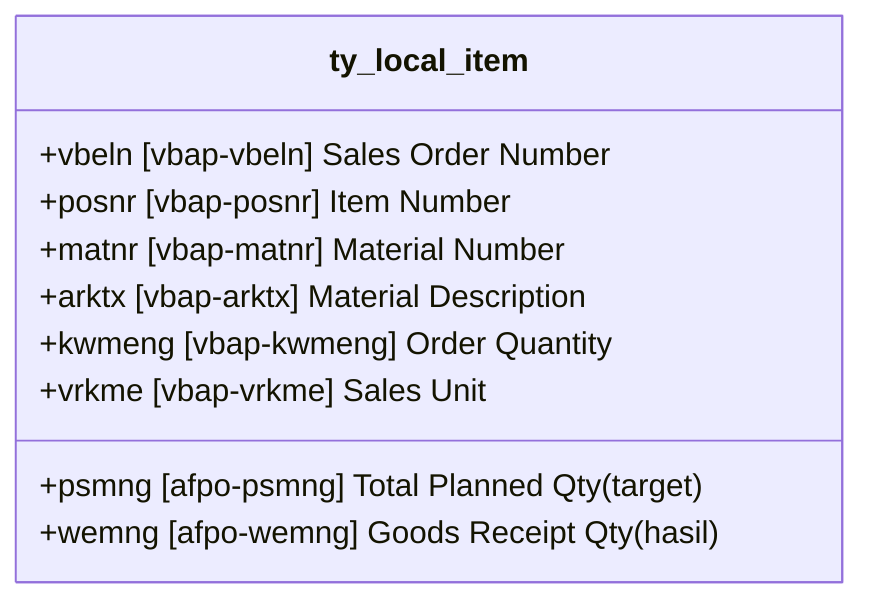
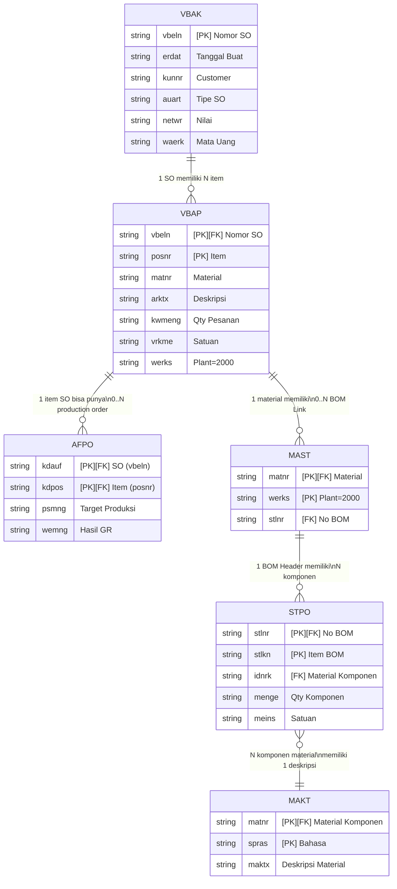
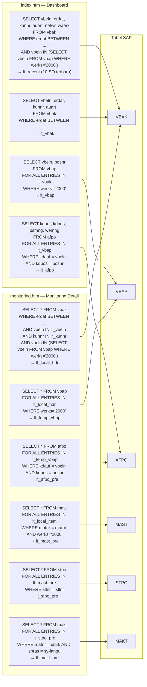
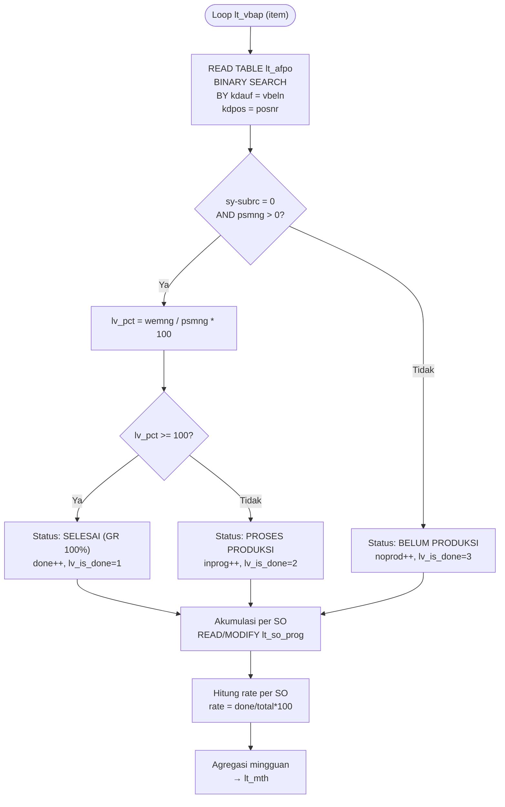
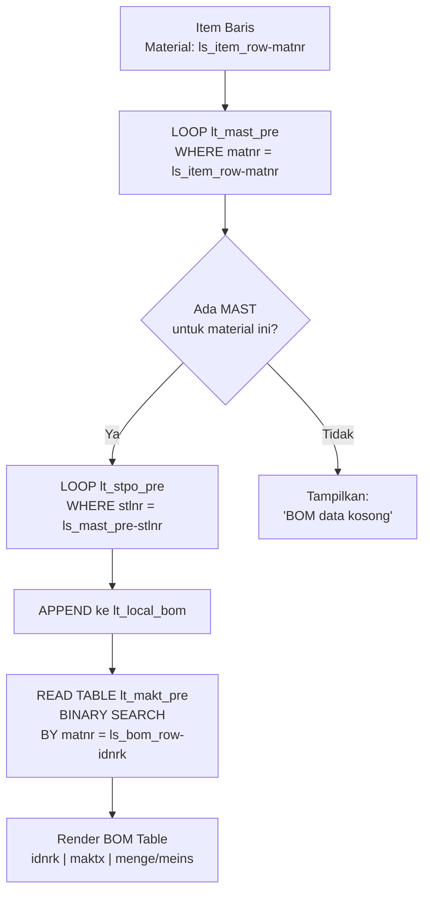

# Entity Relationship Diagram — Central Storage Production Dashboard

## 1. Diagram ERD — Tabel SAP dan Struktur ABAP

---

## 2. Struktur Internal ABAP (Logical View)

Struktur data *custom* yang didefinisikan dalam kode ABAP sebagai turunan/logical view dari tabel-tabel SAP.

### 2.1 `ty_so_prog` — Progress per Sales Order (index.htm:15-25)

**Sumber data**: `LOOP lt_vbap` + `READ lt_afpo BINARY SEARCH` + agregasi.

### 2.2 `ty_mth` — Agregasi Mingguan (index.htm:6-13)

**Sumber data**: `LOOP lt_vbak` → hitung `lv_weekday`, `lv_week_mon` → akumulasi dari `ty_so_prog`.

### 2.3 `ty_local_item` — Detail Item Produksi (monitoring.htm:7-16)

**Sumber data**: `VBAP` + `READ lt_afpo_pre BINARY SEARCH`.

---

## 3. Diagram Hubungan Lengkap

### 3.1 Kardinalitas Relasi

| Relasi | Dari | Ke | Kardinalitas | Penjelasan |
|--------|------|----|--------------|------------|
| R1 | VBAK | VBAP | **1:N** | Satu Sales Order memiliki banyak item |
| R2 | VBAP | AFPO | **1:0..N** | Satu item SO bisa memiliki 0, 1, atau lebih production order. Di kode, produksi diakumulasi dari `psmng`/`wemng` |
| R3 | VBAP | MAST | **1:0..1** | Satu material bisa memiliki 0 atau 1+ BOM (filter `werks='2000'`). Di kode diambil semua `lt_mast_pre` |
| R4 | MAST | STPO | **1:N** | Satu BOM header memiliki banyak komponen |
| R5 | STPO | MAKT | **N:1** | Banyak baris BOM mengacu ke material yang sama; deskripsi dibaca via `READ TABLE ... BINARY SEARCH BY matnr = idnrk` |

---

## 4. Alur Data dan Dependency Query

---

## 5. Alur Klasifikasi Status Item (Business Logic)

Diagram ini menunjukkan bagaimana data dari **VBAK → VBAP → AFPO** diolah untuk menentukan status produksi setiap item.

---

## 6. Alur Relasi BOM (Bill of Materials)

Diagram navigasi dari item ke komponen BOM di halaman monitoring.

---

## 7. Ringkasan Semua Entitas

### 7.1 Tabel SAP (Database)

| Tabel | PK | FK | Nama Lengkap | Peran dalam Aplikasi |
|-------|----|----|--------------|----------------------|
| VBAK | vbeln | — | Sales Document: Header Data | Header SO — data utama dashboard dan monitoring |
| VBAP | vbeln, posnr | VBAK.vbeln | Sales Document: Item Data | Item SO — filter Plant 2000, sumber material |
| AFPO | kdauf, kdpos | VBAP.vbeln/posnr | Production Order Item | Target/hasil produksi — penentu status progress |
| MAST | matnr, werks, stlan, stlal | VBAP.matnr | Material to BOM Link | Penghubung material ke BOM |
| STPO | stlnr, stlkn | MAST.stlnr | BOM Item | Daftar komponen rakitan |
| MAKT | matnr, spras | STPO.idnrk | Material Descriptions | Deskripsi material komponen BOM |

### 7.2 Struktur ABAP (In-Memory)

| Struktur | Didefinisikan di | Tujuan | Sumber Data |
|----------|------------------|--------|-------------|
| ty_mth | index.htm:6-13 | Agregasi mingguan untuk grafik bar | lt_vbak + lt_so_prog |
| ty_so_prog | index.htm:15-25 | Progress per SO untuk tabel 5 SO lambat | lt_vbap + lt_afpo |
| ty_local_item | monitoring.htm:7-16 | Detail item produksi untuk panel monitoring | VBAP + AFPO (pre-fetch) |
