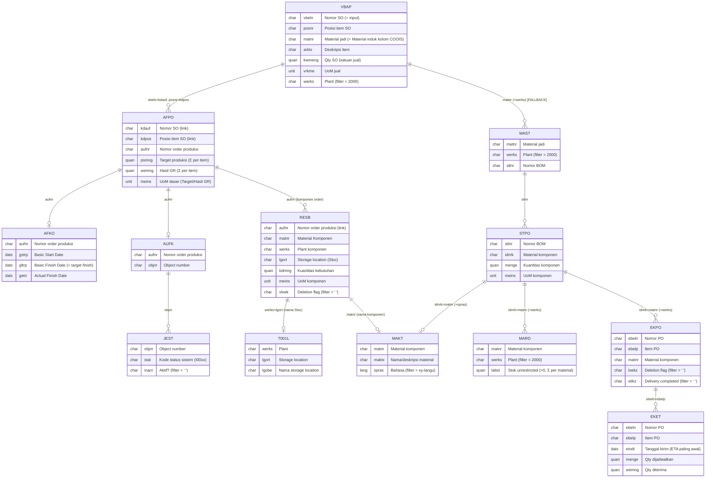

# ERD & Relasi Data — `monitoring_bom.htm` (Tab Item & BOM)

> Melacak **secara rinci** seluruh relasi tabel SAP yang dipakai endpoint
> `monitoring_bom.htm` — fragmen AJAX berat yang merender isi tab **Item & BOM** pada
> panel detail Monitoring. Diperbarui **30 Juni 2026**.
>
> **Perubahan besar (30 Jun 2026):** Daftar Komponen sekarang bergaya **COOIS** — komponen
> dibaca dari **RESB** (komponen/reservasi order produksi) + **T001L** (nama Sloc), bukan lagi
> dari BOM master. BOM master (MAST/STPO) dipakai sebagai **fallback** untuk item yang belum
> punya order produksi. Input tunggal: **`vbeln`** (Nomor Sales Order).

---

## 0. Ringkasan Alur

```
vbeln (input)
   │
   ▼
VBAP ─(vbeln=kdauf, posnr=kdpos)─► AFPO ──┬─(aufnr)─► AFKO  (GSTRP/GLTRP/GETRI)
 │   (vbeln+werks=2000)  (agregat per item)├─(aufnr)─► AUFK ─(objnr)─► JEST (status sistem)
 │                                         └─(aufnr)─► RESB ─(werks+lgort)─► T001L (nama Sloc)
 │                                              (komponen order, gaya COOIS)
 │
 └─ (FALLBACK item tanpa order) ─► MAST ─(stlnr)─► STPO ─┬─(idnrk)─► MAKT  (nama)
                                   (matnr+werks)         ├─(idnrk)─► MARD  (stok, Σ)
                                                         └─(idnrk)─► EKPO ─► EKET (open PO)

MAKT dibaca untuk gabungan komponen (RESB ∪ STPO) sekaligus.
```

Dua jalur penghasil **Daftar Komponen**:

- **Jalur utama — RESB (gaya COOIS):** untuk item yang **punya order produksi** (`AFPO-AUFNR` ada). Menampilkan komponen aktual yang direservasi order + Storage Location, dan expand per komponen (status sistem, kuantitas, basic start/finish, actual finish).
- **Jalur fallback — MAST/STPO (BOM master):** untuk item **tanpa order produksi**. Menampilkan komponen rencana statis + tooltip stok/open-PO (MARD/EKPO/EKET).

Cabang **Progres item** (Target/Hasil GR, tag status, target finish) tetap dari VBAP→AFPO→AFKO/JEST — tidak berubah.

---

## 1. Diagram ERD (Mermaid)



> `||--o{` = satu-ke-banyak (0..n); `||--o|` = satu-ke-nol/satu.

---

## 2. Rincian Per Relasi (urutan eksekusi `SELECT`)

### 2.1 VBAP — Item Sales Order (driver utama)

| Aspek | Keterangan |
|-------|------------|
| **Filter** | `WHERE vbeln = lv_vbeln AND werks = '2000'` |
| **Field** | `vbeln, posnr, matnr, arktx, kwmeng, vrkme` |
| **Output UI** | Tabel item: **Item** (`posnr`), **Material #** (`matnr`), **Deskripsi** (`arktx`), **Qty SO** (`kwmeng vrkme`). `matnr` juga menjadi **kolom "Material" (induk)** pada tabel komponen COOIS. |

### 2.2 VBAP → AFPO — Order Produksi per Item

| Aspek | Keterangan |
|-------|------------|
| **Relasi** | `AFPO-KDAUF = VBAP-VBELN` **dan** `AFPO-KDPOS = VBAP-POSNR`. |
| **Kardinalitas** | **1 item : 0..n order produksi.** |
| **Field** | `kdauf, kdpos, psmng, wemng, meins, aufnr` |
| **Agregasi** | `psmng` & `wemng` **dijumlah per item**; `meins` diambil dari baris pertama. |
| **AUFNR wakil** | Order rasio `wemng/psmng` **terendah** (paling belum selesai) → status & target item. |
| **Peran tambahan** | Daftar `aufnr` item → driver untuk AFKO, AUFK/JEST, dan **RESB**. `AUFNR` tidak kosong = item **punya order** → pakai jalur RESB; kosong → fallback MAST/STPO. |
| **Output UI** | **Target** (`Σpsmng meins`), **Hasil GR** (`Σwemng meins`), bar **Progres**. |

### 2.3 AFPO → AFKO — Tanggal Order

| Aspek | Keterangan |
|-------|------------|
| **Relasi** | `AFKO-AUFNR = AFPO-AUFNR`. |
| **Field** | `aufnr, gstrp` (Basic Start), `gltrp` (Basic Finish / target), `getri` (Actual Finish). |
| **Output UI** | `gltrp` → "Target:" di tag status item. `gstrp/gltrp/getri` → **expand komponen** (Basic Start/Finish, Actual Finish). |
| **Catatan** | `AFKO-GSTRS`/`GETRI` dll adalah **tanggal**; status sistem TIDAK dari AFKO melainkan JEST. Tanggal kosong (`00000000`) → ditampilkan "-". |

### 2.4 AFPO → AUFK — Jembatan ke Status

| Aspek | Keterangan |
|-------|------------|
| **Relasi** | `AUFK-AUFNR = AFPO-AUFNR`. **Field**: `aufnr, objnr`. Murni jembatan ke JEST. |

### 2.5 AUFK → JEST — Status Sistem Order

| Aspek | Keterangan |
|-------|------------|
| **Relasi** | `JEST-OBJNR = AUFK-OBJNR`, **filter** `inact = ' '` (status aktif). |
| **Field** | `objnr, stat`. |
| **Pemetaan** | `I0002→Diproses(REL)` `I0009→Dikonfirmasi(CNF)` `I0045→Selesai Teknis(TECO)`, default `Dibuat(CRTD)`; prioritas tertinggi menang (`code` 1–4). |
| **Output UI** | Tag status di kolom Progres (order wakil) **dan** field **System Status** pada expand komponen (per order komponen). |

### 2.6 AFPO → RESB — Komponen Order Produksi (SUMBER UTAMA, gaya COOIS)

| Aspek | Keterangan |
|-------|------------|
| **Relasi** | `RESB-AUFNR = AFPO-AUFNR` — komponen/reservasi milik order produksi. |
| **Kardinalitas** | 1 order : n komponen. Satu item bisa punya >1 order → komponen ditampilkan per order. |
| **Filter** | `FOR ALL ENTRIES IN lt_afpo_pre WHERE aufnr = …-aufnr AND xloek = ' '` (item tidak dihapus). Baris `matnr` kosong dibuang (`DELETE … WHERE matnr IS INITIAL`). |
| **Field** | `aufnr, matnr` (komponen), `werks, lgort` (Sloc), `bdmng` (kuantitas kebutuhan), `meins`. |
| **Output UI (baris)** | Kolom: **Material Komponen** (`matnr`), **Material** (induk = `VBAP-MATNR`), **Nama Material** (MAKT), **Sloc - Nama Sloc** (`lgort` + T001L). |
| **Output UI (expand)** | **System Status** (JEST order), **Kuantitas** (`bdmng meins`), **Basic Start** (`AFKO-GSTRP`), **Basic Finish** (`AFKO-GLTRP`), **Actual Finish** (`AFKO-GETRI`). |
| **Catatan** | Hanya diisi untuk item yang punya order (`AUFNR` ada). Bila order tidak punya komponen RESB → "Tidak ada komponen order produksi". |

### 2.7 RESB → T001L — Nama Storage Location

| Aspek | Keterangan |
|-------|------------|
| **Relasi** | `T001L-WERKS = RESB-WERKS` **dan** `T001L-LGORT = RESB-LGORT`. |
| **Filter** | `FOR ALL ENTRIES IN lt_resb WHERE werks = …-werks AND lgort = …-lgort` (guard `IF lt_resb IS NOT INITIAL`). |
| **Field** | `werks, lgort, lgobe` (deskripsi Sloc). |
| **Output UI** | Kolom "Sloc - Nama Sloc" = `lgort && ' - ' && lgobe`. `lgort` kosong → "-"; tanpa nama → hanya kode. |

### 2.8 VBAP → MAST — Header BOM Master (FALLBACK)

| Aspek | Keterangan |
|-------|------------|
| **Relasi** | `MAST-MATNR = VBAP-MATNR`, **filter** `werks = '2000'`. **Field**: `matnr, stlnr`. |
| **Peran** | Hanya untuk item **tanpa order**. `stlnr` → STPO. |

### 2.9 MAST → STPO — Komponen BOM Master (FALLBACK)

| Aspek | Keterangan |
|-------|------------|
| **Relasi** | `STPO-STLNR = MAST-STLNR`. **Field**: `stlnr, idnrk, menge, meins`. |
| **Output UI** | Tabel fallback 3 kolom: Material Komponen (`idnrk`), Nama (MAKT), Kuantitas (`menge meins`) + tooltip stok/PO. |
| **Driver** | `idnrk` di-dedup ke `lt_comp` → driver MARD/EKPO/EKET. |

### 2.10 MAKT — Nama Material (RESB ∪ STPO)

| Aspek | Keterangan |
|-------|------------|
| **Relasi** | `MAKT-MATNR = (RESB-MATNR ∪ STPO-IDNRK)`, **filter** `spras = sy-langu`. |
| **Driver** | `lt_makt_drv` = gabungan unik komponen RESB + komponen STPO → satu SELECT MAKT untuk kedua jalur. |
| **Output UI** | Kolom **Nama Material** di kedua tabel. |

### 2.11 STPO → MARD — Stok Komponen (FALLBACK, agregat)

| Aspek | Keterangan |
|-------|------------|
| **Relasi** | `MARD-MATNR = STPO-IDNRK`, **filter** `werks = '2000' AND labst > 0`. |
| **Agregasi** | `labst` **dijumlah per material** (Σ lintas storage location) via `COLLECT`. |
| **Output UI** | `data-stock` tooltip material (jalur fallback). |

### 2.12 STPO → EKPO → EKET — Open PO + ETA (FALLBACK)

| Aspek | Keterangan |
|-------|------------|
| **EKPO** | `EKPO-MATNR = STPO-IDNRK`, filter `werks=2000, loekz=' ', elikz=' '`. Field `ebeln, ebelp, matnr`. |
| **EKET** | `EKET-EBELN+EBELP = EKPO-EBELN+EBELP`. Sisa = `menge − wemng` (>0); agregat per material: `Σ qty`, `eta` = `EINDT` paling awal. |
| **Output UI** | `data-po` + `data-eta` tooltip material (jalur fallback). |

---

## 3. Tabel Kunci Join (ringkas)

| Dari | Ke | Kunci Join | Filter Tambahan | Kardinalitas | Jalur |
|------|----|-----------|-----------------|:------------:|:-----:|
| (input) | VBAP | `vbeln` | `werks=2000` | 1 : n item | inti |
| VBAP | AFPO | `vbeln=kdauf`, `posnr=kdpos` | — | 1 : 0..n | inti |
| AFPO | AFKO | `aufnr` | — | 1 : 1 | inti |
| AFPO | AUFK | `aufnr` | — | 1 : 1 | inti |
| AUFK | JEST | `objnr` | `inact=' '` | 1 : n | inti |
| AFPO | RESB | `aufnr` | `xloek=' '`, `matnr<>kosong` | 1 : n komponen | **COOIS** |
| RESB | T001L | `werks`+`lgort` | — | 1 : 1 | **COOIS** |
| (RESB∪STPO) | MAKT | `matnr` / `idnrk` | `spras=sy-langu` | 1 : 1 | inti |
| VBAP | MAST | `matnr` | `werks=2000` | 1 : 0..n | fallback |
| MAST | STPO | `stlnr` | — | 1 : n | fallback |
| STPO | MARD | `idnrk=matnr` | `werks=2000`, `labst>0` | 1 : n → Σ | fallback |
| STPO | EKPO | `idnrk=matnr` | `werks=2000`, `loekz/elikz=' '` | 1 : n | fallback |
| EKPO | EKET | `ebeln`+`ebelp` | sisa `menge−wemng>0` | 1 : n → Σ | fallback |

---

## 4. Pemetaan Field → Tampilan

### 4.1 Tabel Item (atas) — tidak berubah

| Kolom | Sumber |
|-------|--------|
| Item / Material # / Deskripsi | `VBAP-POSNR / MATNR / ARKTX` |
| Qty SO | `VBAP-KWMENG` + `VBAP-VRKME` |
| Target | `Σ AFPO-PSMNG` + `AFPO-MEINS` |
| Hasil GR | `Σ AFPO-WEMNG` + `AFPO-MEINS` |
| Progres + tag status + Target finish | `Σwemng/Σpsmng`; `JEST` (order wakil); `AFKO-GLTRP` |

### 4.2 Daftar Komponen Order (RESB / COOIS) — baris utama

| Kolom | Sumber | Catatan |
|-------|--------|---------|
| **Material Komponen** | `RESB-MATNR` | — |
| **Material** | `VBAP-MATNR` (induk) | Material jadi yang diproduksi order. |
| **Nama Material** | `MAKT-MAKTX` (by RESB-MATNR) | — |
| **Sloc - Nama Sloc** | `RESB-LGORT` + `T001L-LGOBE` | "kode - nama"; kosong → "-". |

### 4.3 Expand komponen (klik baris)

| Field | Sumber | Catatan |
|-------|--------|---------|
| **System Status** | `JEST` (order RESB-AUFNR) | Label Dibuat/Diproses/Dikonfirmasi/Selesai Teknis. |
| **Kuantitas** | `RESB-BDMNG` + `RESB-MEINS` | Kuantitas kebutuhan komponen. |
| **Basic Start Date** | `AFKO-GSTRP` | "-" bila kosong. |
| **Basic Finish Date** | `AFKO-GLTRP` | "-" bila kosong. |
| **Actual Finish Date** | `AFKO-GETRI` | "-" bila order belum selesai. |

### 4.4 Tabel Komponen BOM Master (fallback) — item tanpa order

| Kolom | Sumber |
|-------|--------|
| Material Komponen | `STPO-IDNRK` (+ tooltip stok/PO) |
| Nama Material | `MAKT-MAKTX` |
| Kuantitas | `STPO-MENGE` + `STPO-MEINS` |
| Tooltip: Stok / Open PO / ETA | `ΣMARD-LABST` / `Σ(EKET-MENGE−WEMNG)` / `min(EKET-EINDT)` |

---

## 5. Guard & Edge Case

| Kondisi | Penanganan |
|---------|------------|
| `vbeln` kosong | "Parameter Tidak Valid", tanpa query. |
| VBAP kosong | "Tidak ada item produksi untuk Sales Order ini." |
| Item punya order (`AUFNR` ada) | Jalur **RESB**. Bila order tanpa komponen → "Tidak ada komponen order produksi (RESB)". |
| Item tanpa order | Jalur **fallback** MAST/STPO. Bila BOM tidak ada → "BOM belum terpasang di Plant 2000." |
| AFPO kosong total | AFKO/AUFK/JEST/RESB di-skip (`IF lt_afpo_pre IS NOT INITIAL`); semua item → fallback. |
| RESB `lgort` kosong | Kolom Sloc → "-". |
| AFKO tanggal `00000000` | Field expand → "-". |
| STPO kosong | MARD/EKPO/EKET di-skip (`IF lt_stpo_pre IS NOT INITIAL`). |
| `id` baris komponen | `compdet-<vbeln>-c<seq>`; `seq` counter global → unik per response. Di-toggle JS `toggleCompRow`. |

---

## 6. Catatan Performa

- Query: **VBAP, AFPO, AFKO, AUFK, JEST, RESB, T001L, MAST, STPO, MAKT, MARD, EKPO, EKET** (±13). Endpoint sengaja **lazy-load** (dipanggil saat tab Item & BOM dibuka) + cache `soBomCache` per `vbeln`.
- RESB di-FAE atas daftar `aufnr` (auto-dedup). T001L & MAKT pakai driver unik. MARD/EKPO/EKET hanya untuk fallback (driver STPO).
- Tabel internal `SORT … BINARY SEARCH` (join in-memory O(log n)); render komponen via control-break atas `lt_afpo_pre` (per order) lalu `lt_resb` (per komponen).

---

*Lihat juga: `erd.md` (ERD umum), `update-monitoring.md` (strategi & pemisahan endpoint), `central-storage-known-issues` (verifikasi kode status JEST & deployment).*
