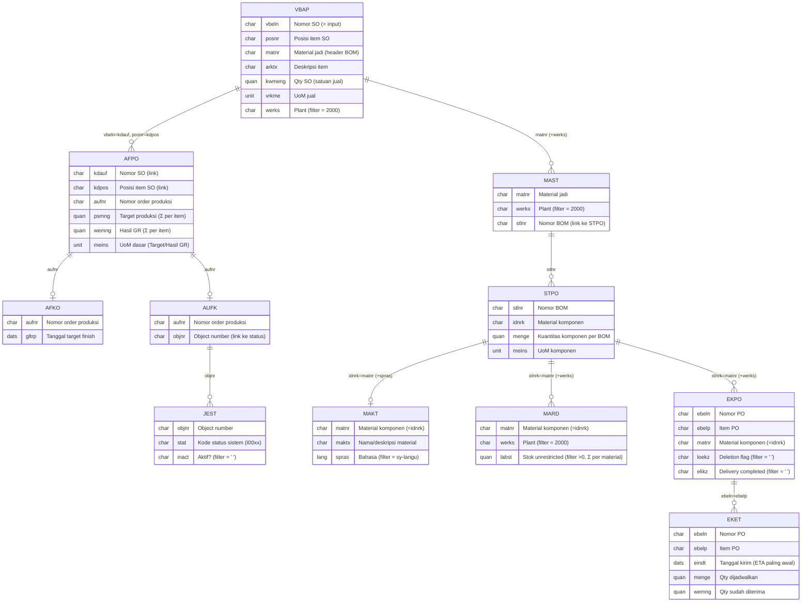

# ERD & Relasi Data — `monitoring_bom.htm` (Tab Item & BOM)

> Dokumen ini melacak **secara rinci** seluruh relasi tabel SAP yang dipakai oleh endpoint
> `monitoring_bom.htm` — fragmen AJAX berat yang merender isi tab **Item & BOM** pada panel
> detail Monitoring. Dibuat **30 Juni 2026**, mengikuti kode terkini.
>
> Endpoint ini dipanggil lazy oleh `js.js loadBOM()` saat pengguna pertama kali membuka tab
> Item & BOM (lihat `update-monitoring.md`). Input tunggal: **`vbeln`** (Nomor Sales Order).

---

## 0. Ringkasan Alur

```
vbeln (input)
   │
   ▼
VBAP ──(matnr)──────────────► MAST ──(stlnr)──► STPO ──┬─(idnrk)─► MAKT  (nama komponen)
 │  (vbeln+werks=2000)         (matnr+werks)    (stlnr) ├─(idnrk)─► MARD  (stok, Σ per material)
 │                                                      └─(idnrk)─► EKPO ─(ebeln+ebelp)─► EKET (open PO + ETA)
 │
 └─(vbeln=kdauf, posnr=kdpos)─► AFPO ──┬─(aufnr)─► AFKO            (target finish GLTRP)
        (agregat per item)             └─(aufnr)─► AUFK ─(objnr)─► JEST (status sistem order)
```

Ada **dua cabang** yang berangkat dari hasil VBAP:

- **Cabang Produksi** (kiri-bawah): VBAP → AFPO → AFKO/AUFK→JEST. Menghasilkan **progres item** (Target/Hasil GR), **status order**, dan **tanggal target**.
- **Cabang BOM/Material** (kanan-atas): VBAP → MAST → STPO → MAKT/MARD/EKPO→EKET. Menghasilkan **daftar komponen BOM** + **stok** + **open PO** untuk tooltip material.

---

## 1. Diagram ERD (Mermaid)



> Notasi kardinalitas Mermaid: `||--o{` = satu-ke-banyak (0..n), `||--o|` = satu-ke-nol/satu.

---

## 2. Rincian Per Relasi

Urutan di bawah mengikuti urutan eksekusi `SELECT` di kode.

### 2.1 VBAP — Item Sales Order (driver utama)

| Aspek | Keterangan |
|-------|------------|
| **Peran** | Titik awal. Mengambil seluruh item SO di Plant 2000 untuk `vbeln` yang diklik. |
| **Filter** | `WHERE vbeln = lv_vbeln AND werks = '2000'` |
| **Field dipakai** | `vbeln, posnr, matnr, arktx, kwmeng, vrkme` |
| **Output UI** | Kolom **Item** (`posnr`), **Material #** (`matnr`), **Deskripsi Komponen** (`arktx`), **Qty SO** (`kwmeng vrkme`). |
| **Catatan** | `matnr` = material jadi → menjadi kunci ke MAST (cabang BOM). `vbeln`+`posnr` → kunci ke AFPO (cabang produksi). Jika kosong → "Tidak ada item produksi untuk Sales Order ini." |

### 2.2 VBAP → AFPO — Order Produksi per Item

| Aspek | Keterangan |
|-------|------------|
| **Relasi** | `AFPO-KDAUF = VBAP-VBELN` **dan** `AFPO-KDPOS = VBAP-POSNR`. (KDAUF/KDPOS = referensi sales order pada order produksi.) |
| **Kardinalitas** | **1 item SO : 0..n order produksi.** Satu item bisa punya banyak `aufnr` (produksi terpisah/parsial/rework). **Inilah alasan agregasi.** |
| **Filter** | `FOR ALL ENTRIES IN lt_temp_vbap WHERE kdauf = …-vbeln AND kdpos = …-posnr` (di-guard `IF lt_temp_vbap IS NOT INITIAL`). |
| **Field dipakai** | `kdauf, kdpos, psmng, wemng, meins, aufnr` |
| **Agregasi** | `psmng` (Target) & `wemng` (Hasil GR) **DIJUMLAH per item** menjelajah baris AFPO yang berkunci sama. `meins` (UoM dasar) diambil dari baris pertama (sama untuk semua order satu material). |
| **AUFNR wakil** | Untuk tag status order: dipilih order **paling belum selesai** = rasio `wemng/psmng` **terendah** (`psmng=0` dianggap rasio 0). Disimpan ke `ls_item_row-aufnr`. |
| **Output UI** | Kolom **Target** (`psmng meins`), **Hasil GR** (`wemng meins`), bar **Progres** (`wemng/psmng*100`, cap 100). Item tanpa AFPO → "No Prod". |
| **Mengapa agregasi penting** | Tanpa menjumlah, pembacaan 1 baris (`READ … BINARY SEARCH`) bersifat non-deterministik → status bisa bertentangan antar tampilan. Lihat `update-monitoring.md` Masalah #1. |

### 2.3 AFPO → AFKO — Tanggal Target Finish

| Aspek | Keterangan |
|-------|------------|
| **Relasi** | `AFKO-AUFNR = AFPO-AUFNR` (kepala order produksi). |
| **Kardinalitas** | 1 order : 1 AFKO. |
| **Filter** | `FOR ALL ENTRIES IN lt_afpo_pre WHERE aufnr = …-aufnr` (guard `IF lt_afpo_pre IS NOT INITIAL`). |
| **Field dipakai** | `aufnr, gltrp` (basic finish date / tanggal target selesai). |
| **Output UI** | Baris **"Target: DD/MM/YYYY"** di bawah tag status (hanya untuk `aufnr` wakil). |
| **Catatan penting** | **`AFKO-GSTRS` adalah TANGGAL, bukan teks status.** Status sistem TIDAK diambil dari AFKO, melainkan dari JEST (lihat 2.5). |

### 2.4 AFPO → AUFK — Jembatan ke Status Sistem

| Aspek | Keterangan |
|-------|------------|
| **Relasi** | `AUFK-AUFNR = AFPO-AUFNR`. |
| **Field dipakai** | `aufnr, objnr` (Object number — kunci universal status objek SAP). |
| **Peran** | AUFK menyediakan `objnr` yang dibutuhkan untuk membaca status manajemen di JEST. Murni tabel jembatan. |
| **Filter** | `FOR ALL ENTRIES IN lt_afpo_pre WHERE aufnr = …-aufnr`. |

### 2.5 AUFK → JEST — Status Sistem Order Produksi

| Aspek | Keterangan |
|-------|------------|
| **Relasi** | `JEST-OBJNR = AUFK-OBJNR`. |
| **Kardinalitas** | 1 order : **n** baris status (tiap status sistem = 1 baris). |
| **Filter** | `FOR ALL ENTRIES IN lt_aufk_pre WHERE objnr = …-objnr AND inact = ' '` → hanya status **aktif** (belum dibatalkan). |
| **Field dipakai** | `objnr, stat` (kode status internal, format `I00xx`). |
| **Pemetaan kode** | Diringkas ke `code` 1–4 (prioritas tertinggi menang): |

| `JEST-STAT` | Arti | `code` | Label UI | Kelas CSS |
|-------------|------|:------:|----------|-----------|
| (default, mis. I0001 CRTD) | Dibuat | 1 | Dibuat | `ord-crt` |
| `I0002` (REL) | Direlease/diproses | 2 | Diproses | `ord-rel` |
| `I0009` (CNF) | Dikonfirmasi | 3 | Dikonfirmasi | `ord-cnf` |
| `I0045` (TECO) | Selesai teknis | 4 | Selesai Teknis | `ord-teco` |

| Aspek | Keterangan |
|-------|------------|
| **Logika** | Loop JEST per order: `I0002→code≥2`, `I0009→code≥3`, `I0045→code=4`; default 1. Disimpan di `lt_ord_st` per `aufnr`. |
| **Output UI** | Tag status berwarna di kolom Progres (untuk `aufnr` wakil saja). |
| **⚠️ Verifikasi** | Kode status internal bergantung customizing. Cek kembali bila label tidak sesuai (lihat catatan `central-storage-known-issues`). |

### 2.6 VBAP → MAST — Header BOM Material Jadi

| Aspek | Keterangan |
|-------|------------|
| **Relasi** | `MAST-MATNR = VBAP-MATNR` (material jadi). |
| **Filter** | `FOR ALL ENTRIES IN lt_local_item WHERE matnr = …-matnr AND werks = '2000'` (guard `IF lt_local_item IS NOT INITIAL`). |
| **Field dipakai** | `matnr, stlnr` (nomor BOM). |
| **Kardinalitas** | 1 material : 0..n BOM (`stlnr`) di plant. |
| **Output UI** | Tidak langsung; `stlnr` → kunci ke STPO. Bila tak ada → "BOM belum terpasang di Plant 2000." |

### 2.7 MAST → STPO — Komponen BOM

| Aspek | Keterangan |
|-------|------------|
| **Relasi** | `STPO-STLNR = MAST-STLNR`. |
| **Filter** | `FOR ALL ENTRIES IN lt_mast_pre WHERE stlnr = …-stlnr`. |
| **Field dipakai** | `stlnr, idnrk` (material komponen), `menge` (kuantitas), `meins` (UoM komponen). |
| **Kardinalitas** | 1 BOM : n komponen. |
| **Output UI** | Tabel **Daftar Komponen BOM** (baris ekspandabel per item): kolom Material Komponen (`idnrk`), Nama (dari MAKT), Kuantitas (`menge meins`). |
| **⚠️ Guard A1** | Seluruh blok MAKT/MARD/EKPO dibungkus `IF lt_stpo_pre IS NOT INITIAL` — bila STPO kosong, FAE tanpa guard akan menarik SELURUH tabel. |
| **Driver unik (C4)** | `idnrk` di-dedup ke `lt_comp` (SORT + DELETE ADJACENT DUPLICATES) sebagai driver FAE untuk MAKT/MARD/EKPO agar tidak ada baris duplikat. |

### 2.8 STPO → MAKT — Nama/Deskripsi Komponen

| Aspek | Keterangan |
|-------|------------|
| **Relasi** | `MAKT-MATNR = STPO-IDNRK`. |
| **Filter** | `FOR ALL ENTRIES IN lt_comp WHERE matnr = …-idnrk AND spras = sy-langu`. |
| **Field dipakai** | `matnr, maktx` (teks material pada bahasa login). |
| **Output UI** | Kolom **Nama Material** di tabel BOM + `data-name` pada tooltip material. |

### 2.9 STPO → MARD — Stok Komponen (agregat per material)

| Aspek | Keterangan |
|-------|------------|
| **Relasi** | `MARD-MATNR = STPO-IDNRK`. |
| **Filter** | `FOR ALL ENTRIES IN lt_comp WHERE matnr = …-idnrk AND werks = '2000' AND labst > 0`. |
| **Field dipakai** | `matnr, labst` (stok unrestricted). |
| **Agregasi** | MARD bergranularitas **storage location (LGORT)** → banyak baris per material. `labst` **DIJUMLAH per material** via `COLLECT` ke `lt_mard_agg`. |
| **Output UI** | `data-stock` pada tooltip material → indikator "✓ Cukup / ⚠ Kurang Stok" (dibanding `menge` BOM, di JS). |

### 2.10 STPO → EKPO — Open Purchase Order

| Aspek | Keterangan |
|-------|------------|
| **Relasi** | `EKPO-MATNR = STPO-IDNRK`. |
| **Filter** | `FOR ALL ENTRIES IN lt_comp WHERE matnr = …-idnrk AND werks = '2000' AND loekz = ' ' AND elikz = ' '` → item PO **aktif** (tidak dihapus & belum lengkap penerimaannya). |
| **Field dipakai** | `ebeln, ebelp, matnr`. |
| **Kardinalitas** | 1 material : n item PO. |
| **Peran** | Menyediakan `ebeln`+`ebelp` sebagai kunci ke jadwal pengiriman (EKET). |

### 2.11 EKPO → EKET — Jadwal Pengiriman & Qty Terbuka

| Aspek | Keterangan |
|-------|------------|
| **Relasi** | `EKET-EBELN = EKPO-EBELN` **dan** `EKET-EBELP = EKPO-EBELP`. |
| **Filter** | `FOR ALL ENTRIES IN lt_ekpo_pre WHERE ebeln = …-ebeln AND ebelp = …-ebelp` (guard `IF lt_ekpo_pre IS NOT INITIAL`). |
| **Field dipakai** | `ebeln, ebelp, eindt, menge, wemng`. |
| **Perhitungan** | Per baris EKET: **sisa = `menge − wemng`**; lewati bila ≤ 0. Lalu di-agregasi **per material** (via `lt_ekpo_pre` untuk mendapat `matnr`): `qty` dijumlah, `eta` = `EINDT` **paling awal**. Hasil di `lt_open_agg`. |
| **Output UI** | `data-po` (total qty terbuka) + `data-eta` (DD/MM) pada tooltip material → baris "Open PO masuk … ETA …". |

---

## 3. Tabel Kunci Join (ringkas)

| Dari | Ke | Kunci Join | Filter Tambahan | Kardinalitas |
|------|----|-----------|-----------------|:------------:|
| (input) | VBAP | `vbeln` | `werks = 2000` | 1 : n item |
| VBAP | AFPO | `vbeln=kdauf`, `posnr=kdpos` | — | 1 : 0..n order |
| AFPO | AFKO | `aufnr` | — | 1 : 1 |
| AFPO | AUFK | `aufnr` | — | 1 : 1 |
| AUFK | JEST | `objnr` | `inact = ' '` | 1 : n status |
| VBAP | MAST | `matnr` | `werks = 2000` | 1 : 0..n BOM |
| MAST | STPO | `stlnr` | — | 1 : n komponen |
| STPO | MAKT | `idnrk=matnr` | `spras = sy-langu` | 1 : 1 |
| STPO | MARD | `idnrk=matnr` | `werks = 2000`, `labst > 0` | 1 : n lgort → Σ |
| STPO | EKPO | `idnrk=matnr` | `werks = 2000`, `loekz=' '`, `elikz=' '` | 1 : n PO item |
| EKPO | EKET | `ebeln`+`ebelp` | sisa `menge−wemng > 0` | 1 : n schedule → Σ |

---

## 4. Agregasi & Aturan Turunan

1. **AFPO per item** (`kdauf`+`kdpos`): `Σ psmng`, `Σ wemng`. Status item via `ZCL_CS_UTIL=>item_status`: `psmng>0 & GR≥target`→Selesai; `psmng>0 & GR<target`→Proses; lainnya→Belum Produksi.
2. **AUFNR wakil**: order dengan rasio `wemng/psmng` terendah (paling belum selesai) → status & target yang ditampilkan.
3. **MARD per material**: `Σ labst` lintas storage location.
4. **EKET per material**: `Σ (menge − wemng)` untuk yang sisa > 0; `eta` = `eindt` paling awal.
5. **JEST**: prioritas status tertinggi yang aktif menang (TECO > CNF > REL > CRTD).

---

## 5. Guard & Edge Case (penting saat tracking)

| Kondisi | Penanganan di kode |
|---------|--------------------|
| `vbeln` kosong/invalid | Render "Parameter Tidak Valid", tanpa query. |
| VBAP kosong | Tabel menampilkan "Tidak ada item produksi untuk Sales Order ini." |
| AFPO kosong (item tanpa order) | Item tampil "No Prod"; AFKO/AUFK/JEST tidak dijalankan (`IF lt_afpo_pre IS NOT INITIAL`). |
| STPO kosong (material punya MAST tanpa komponen) | MAKT/MARD/EKPO **di-skip** (`IF lt_stpo_pre IS NOT INITIAL`) — **wajib**, mencegah FAE menarik seluruh tabel (bug A1). |
| EKPO kosong | EKET tidak dijalankan (`IF lt_ekpo_pre IS NOT INITIAL`). |
| Komponen tanpa MAKT/MARD/EKPO | Nama kosong / stok 0 / "Tidak ada" open PO — semua di-`READ … BINARY SEARCH` dengan cek `sy-subrc`. |
| BOM tidak ada untuk item | Baris ekspandabel menampilkan "BOM belum terpasang di Plant 2000." |

---

## 6. Pemetaan Field → Kolom Tampilan

| Kolom / Elemen UI | Sumber Field | Catatan |
|-------------------|--------------|---------|
| Item | `VBAP-POSNR` | — |
| Material # | `VBAP-MATNR` | Material jadi (header BOM). |
| Deskripsi Komponen | `VBAP-ARKTX` | — |
| **Qty SO** | `VBAP-KWMENG` + `VBAP-VRKME` | UoM jual. |
| **Target** | `Σ AFPO-PSMNG` + `AFPO-MEINS` | UoM dasar. |
| **Hasil GR** | `Σ AFPO-WEMNG` + `AFPO-MEINS` | UoM dasar. |
| Progres (bar + %) | `Σ wemng / Σ psmng × 100` | Cap 100; warna dari `ZCL_CS_UTIL=>prog_bar_class`. |
| Tag status order | `JEST-STAT` (via AUFK/objnr) | Order wakil. |
| Target finish | `AFKO-GLTRP` | Order wakil; format `fmt_date`. |
| BOM: Material Komponen | `STPO-IDNRK` | `data-matnr` tooltip. |
| BOM: Nama Material | `MAKT-MAKTX` | `data-name` tooltip. |
| BOM: Kuantitas | `STPO-MENGE` + `STPO-MEINS` | — |
| Tooltip: Stok | `Σ MARD-LABST` | `data-stock`. |
| Tooltip: Open PO | `Σ (EKET-MENGE − EKET-WEMNG)` | `data-po`. |
| Tooltip: ETA | `min(EKET-EINDT)` | `data-eta`, format DD/MM. |

---

## 7. Catatan Performa

- Total query endpoint ini: **VBAP, AFPO, AFKO, AUFK, JEST, MAST, STPO, MAKT, MARD, EKPO, EKET** (±11). Karena berat, **sengaja dipisah** dari `monitoring_detail.htm` dan dimuat lazy hanya saat tab Item & BOM dibuka (cache `soBomCache` per `vbeln`).
- Seluruh FAE memakai **driver unik** (`lt_comp` untuk idnrk) dan **guard non-initial** agar tidak full-scan.
- Tabel internal disusun `SORT … BINARY SEARCH` untuk join in-memory O(log n).

---

*Lihat juga: `erd.md` (ERD umum aplikasi), `update-monitoring.md` (strategi & alasan pemisahan endpoint), `central-storage-known-issues` (status verifikasi kode status JEST).*
