# Flowchart — Monitoring Production (Central Storage)

> Diagram alur sistem secara detail mencakup BSP Application dan ABAP Report.

---

## Daftar Isi

1. [Flowchart Sistem Utama](#1-flowchart-sistem-utama)
2. [Flowchart BSP — index.htm](#2-flowchart-bsp--indexhtm)
3. [Flowchart BSP — main.htm (Detail)](#3-flowchart-bsp--mainhtm-detail)
4. [Flowchart ABAP Report — ZMON_CNC_KMI2](#4-flowchart-abap-report--zmon_cnc_kmi2)
5. [Flowchart Database Query](#5-flowchart-database-query)
6. [Flowchart Progress Bar Logic](#6-flowchart-progress-bar-logic)
7. [Flowchart JavaScript Filter (Client-side)](#7-flowchart-javascript-filter-client-side)
8. [Flowchart Error Handling](#8-flowchart-error-handling)
9. [Activity Diagram — BSP Path](#9-activity-diagram--bsp-path)
10. [Activity Diagram — Report Path](#10-activity-diagram--report-path)
11. [State Diagram — Halaman main.htm](#11-state-diagram--halaman-mainhtm)
12. [Timeline — Request/Response Lifecycle](#12-timeline--requestresponse-lifecycle)

---

## 1. Flowchart Sistem Utama

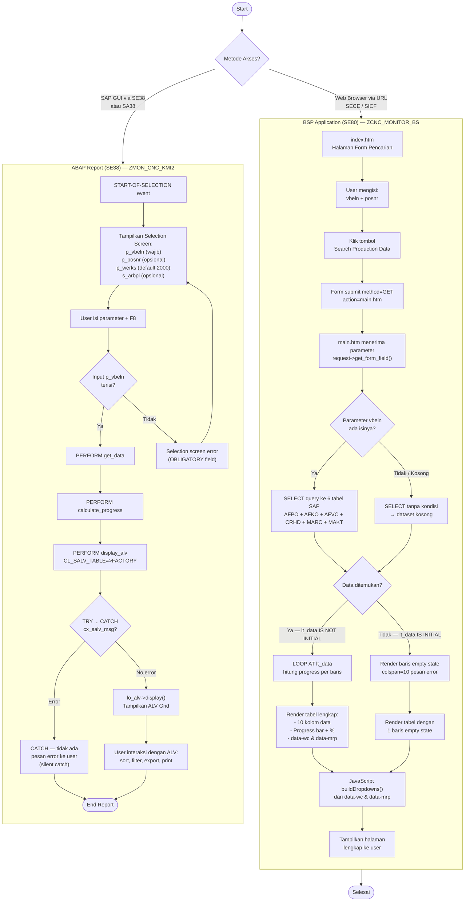

---

## 2. Flowchart BSP — index.htm

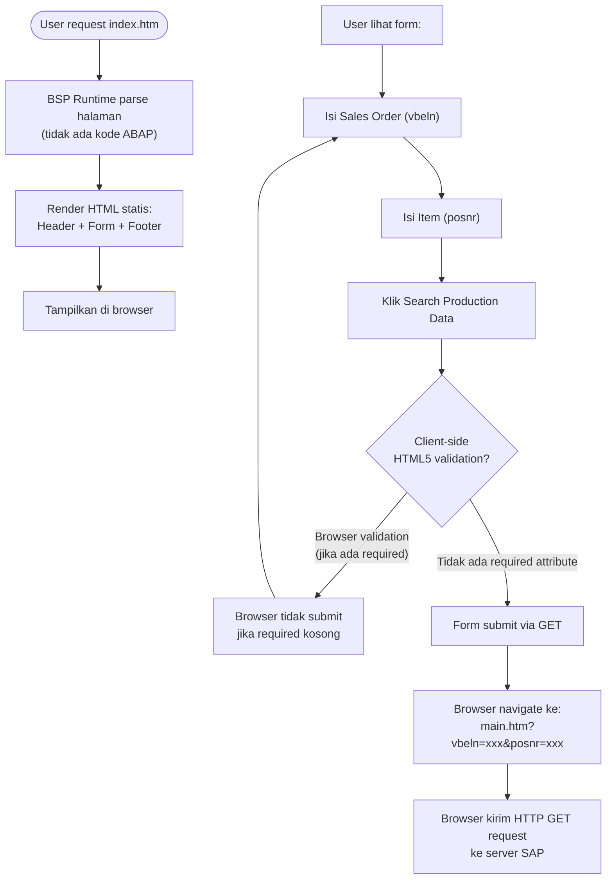

### Detail Form HTML (index.htm baris 144–155)

```html
<form method="get" action="main.htm">
  <input type="text" name="vbeln" placeholder="e.g. 4500001234">
  <input type="text" name="posnr" placeholder="e.g. 000010">
  <input type="submit" value="Search Production Data">
</form>
```

**Catatan:** Tidak ada `required` attribute → browser tidak akan memvalidasi. Semua data dikirim apa adanya.

---

## 3. Flowchart BSP — main.htm (Detail)

### 3a. ABAP Processing Phase

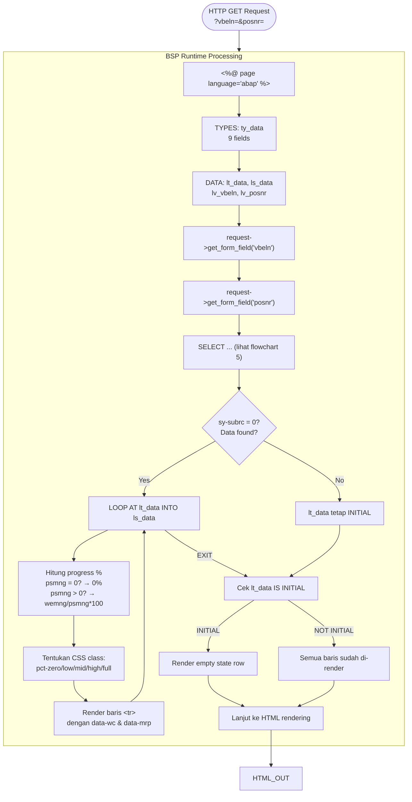

### 3b. HTML + CSS + JS Rendering Phase

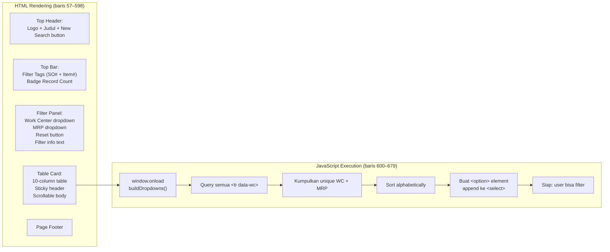

### 3c. User Interaction (Post-Render)

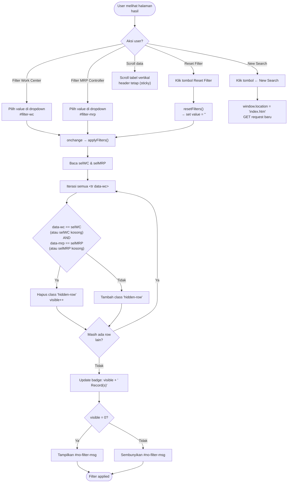

---

## 4. Flowchart ABAP Report — ZMON_CNC_KMI2

### 4a. Report Lifecycle Penuh

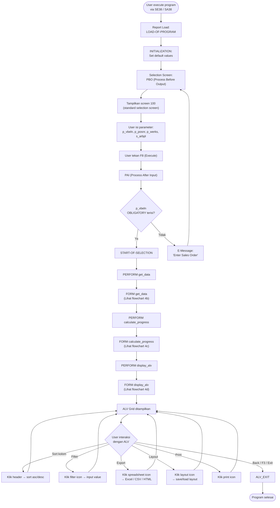

### 4b. FORM get_data (Detail)

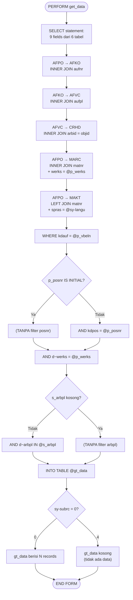

### 4c. FORM calculate_progress (Detail)

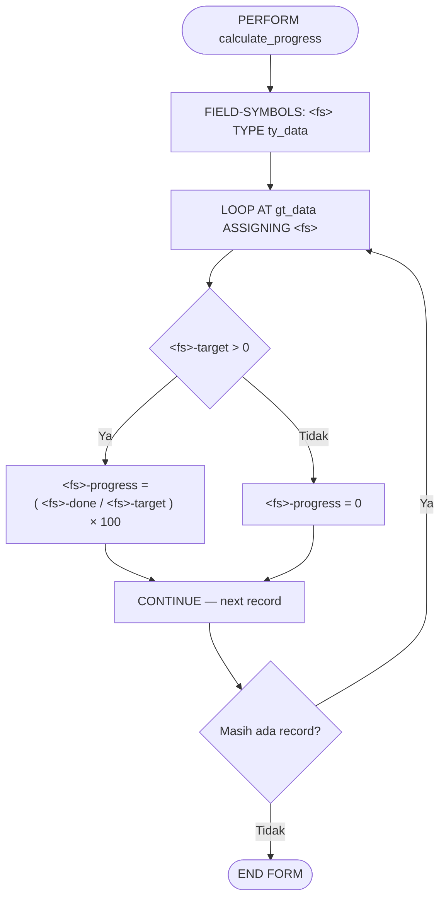

### 4d. FORM display_alv (Detail)

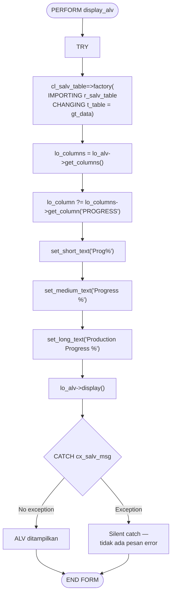

---

## 5. Flowchart Database Query

### 5a. Query Execution Plan

```mermaid
flowchart TD
  QSTART(["SELECT dari AFPO (a)"]) --> ACCESS{"Metode access<br/>AFPO"}

  ACCESS -->|"Index pada (kdauf, kdpos)"| INDEX_SCAN["INDEX RANGE SCAN<br/>AFPO~KDDUA<br/>kdauf = X, kdpos = Y"]
  ACCESS -->|"Full table scan<br/>(tanpa index)"| FULL_SCAN["FULL TABLE SCAN<br/>AFPO — filter kdauf + kdpos<br/>setelah scan"]

  INDEX_SCAN --> ROW["Satu/beberapa row<br/>dari AFPO"]
  FULL_SCAN --> ROW

  ROW --> JOIN_AFKO["Untuk setiap row AFPO:<br/>INNER JOIN AFKO (b)"]
  JOIN_AFKO --> AFKO_ACCESS{"Access AFKO via?"}
  AFKO_ACCESS -->|"Primary Key aufnr"| AFKO_PK["INDEX UNIQUE SCAN<br/>AFKO~0 (aufnr)"]
  AFKO_ACCESS -->|"Lainnya"| AFKO_OTHER

  AFKO_PK --> JOIN_AFVC["INNER JOIN AFVC (c)"]
  AFKO_OTHER --> JOIN_AFVC
  JOIN_AFVC --> AFVC_ACCESS{"Access AFVC via?"}
  AFVC_ACCESS -->|"Primary Key aufpl"| AFVC_PK["INDEX UNIQUE SCAN<br/>AFVC~0 (aufpl)"]

  AFVC_PK --> JOIN_CRHD["INNER JOIN CRHD (d)"]
  JOIN_CRHD --> CRHD_ACCESS{"Access CRHD via?"}
  CRHD_ACCESS -->|"Primary Key objid"| CRHD_PK["INDEX UNIQUE SCAN<br/>CRHD~0 (objid)"]

  CRHD_PK --> JOIN_MARC["INNER JOIN MARC (f)"]
  JOIN_MARC --> MARC_ACCESS{"Access MARC via?"}
  MARC_ACCESS -->|"Primary Key<br/>matnr + werks"| MARC_PK["INDEX UNIQUE SCAN<br/>MARC~0 (matnr + werks = 2000)"]

  MARC_PK --> JOIN_MAKT["LEFT JOIN MAKT (e)"]
  JOIN_MAKT --> MAKT_ACCESS{"Access MAKT via?"}
  MAKT_ACCESS -->|"Primary Key<br/>matnr + spras"| MAKT_PK["INDEX UNIQUE SCAN<br/>MAKT~0 (matnr + spras)"]

  MAKT_PK --> RESULT["Hasil akhir:<br/>1 row per operation<br/>per production order"]

  RESULT --> NOTE1["Catatan:<br/>JOIN AFKO-AFVC bisa<br/>menghasilkan MULTIPLE ROWS<br/>jika 1 order punya >1 operation<br/>(routing multi-step)"]

  join_style fill:#e1f5fe,stroke:#0288d1
  access_style fill:#fff3e0,stroke:#ff9800
  result_style fill:#e8f5e9,stroke:#43a047

  class JOIN_AFKO,JOIN_AFVC,JOIN_CRHD,JOIN_MARC,JOIN_MAKT join_style
  class ACCESS,AFKO_ACCESS,AFVC_ACCESS,CRHD_ACCESS,MARC_ACCESS,MAKT_ACCESS access_style
  class RESULT,NOTE1 result_style
```

### 5b. Data Flow Diagram (DFD Level 0)

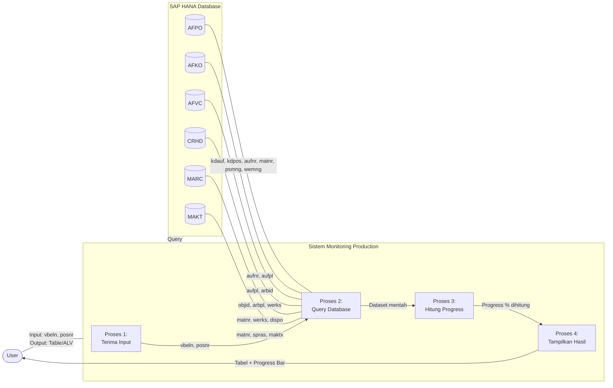

### 5c. Data Flow Diagram (DFD Level 1 — Proses Query)

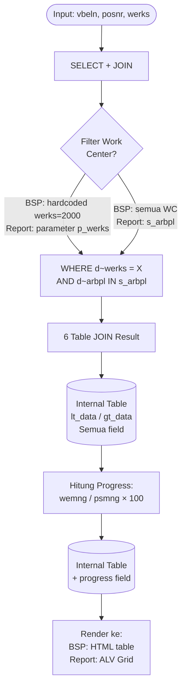

---

## 6. Flowchart Progress Bar Logic

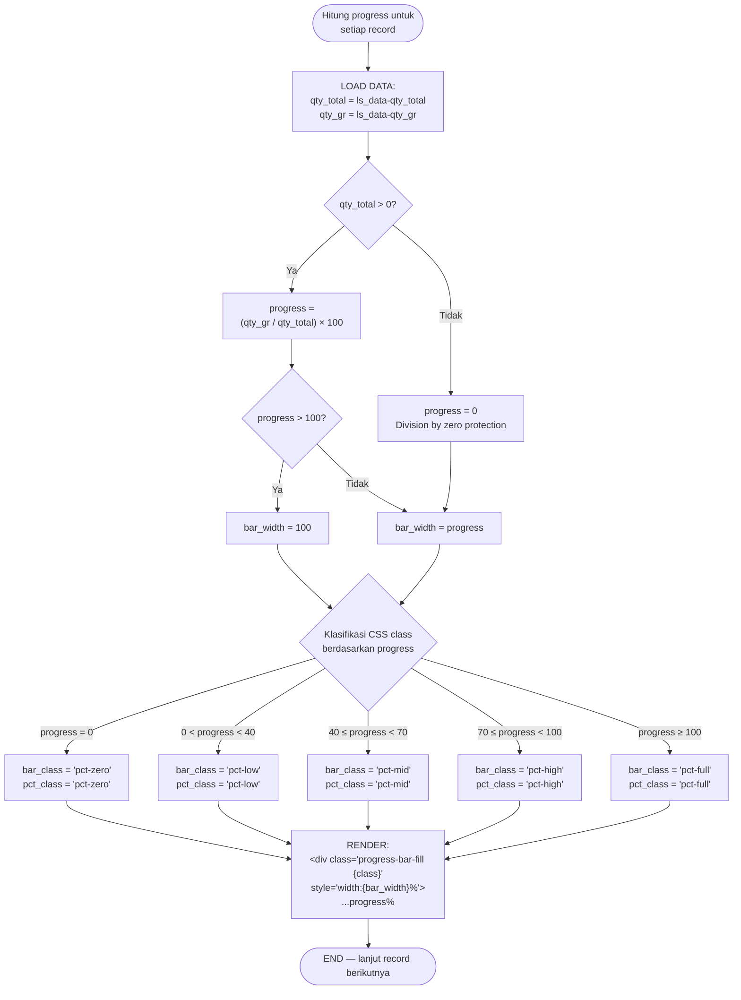

### CSS Class Visual Reference

| CSS Class | Bar Background | Bar Box Shadow | Text Color | Text Badge |
|-----------|---------------|----------------|------------|------------|
| `pct-zero` | `#d1d5db` (abu-abu) | None | `#9ca3af` | - |
| `pct-low` | `linear-gradient(90deg, #86efac, #4ade80)` | None | `#16a34a` | - |
| `pct-mid` | `linear-gradient(90deg, #22c55e, #16a34a)` | None | `#15803d` | - |
| `pct-high` | `linear-gradient(90deg, #16a34a, #15803d)` | None | `#15803d` | - |
| `pct-full` | `linear-gradient(90deg, #0f766e, #15803d)` | `0 0 8px rgba(21,128,61,0.5)` | `#14532d` | `bg #dcfce7`, `border #86efac`, `border-radius 6px` |

---

## 7. Flowchart JavaScript Filter (Client-side)

### 7a. buildDropdowns() — Initialization

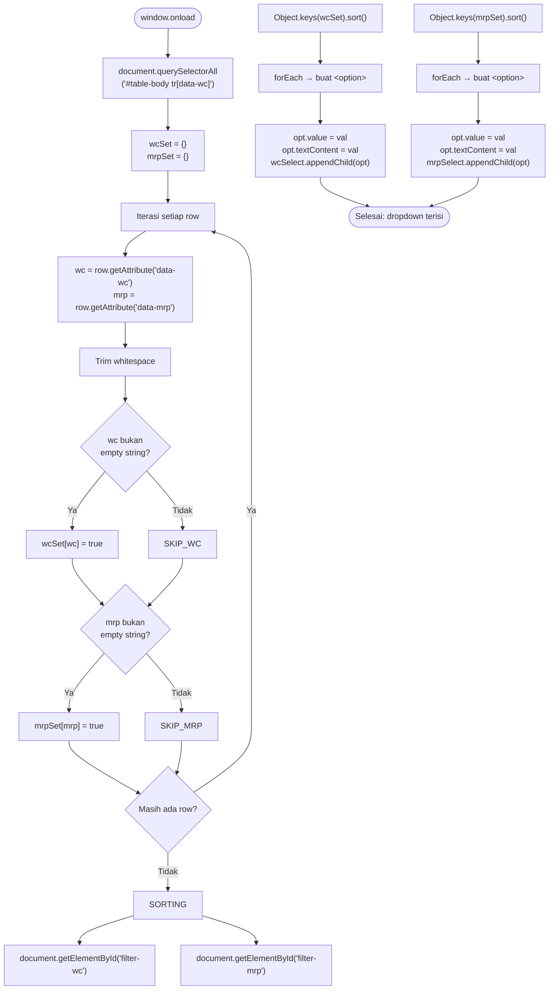

### 7b. applyFilters() — Execution

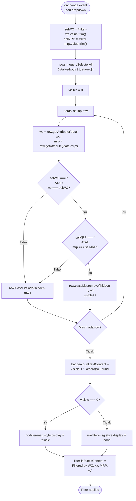

### 7c. resetFilters() — Execution

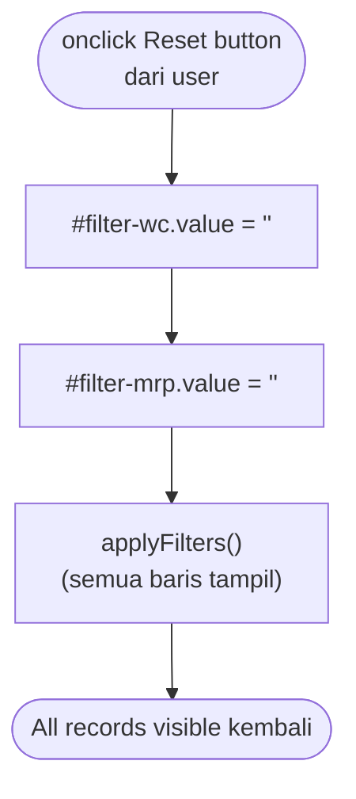

---

## 8. Flowchart Error Handling

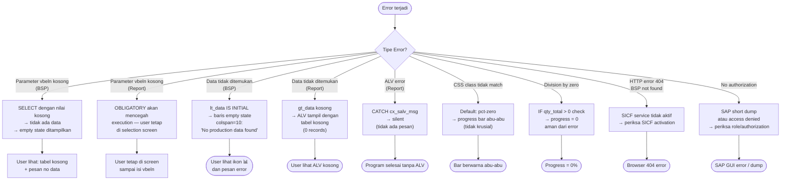

---

## 9. Activity Diagram — BSP Path

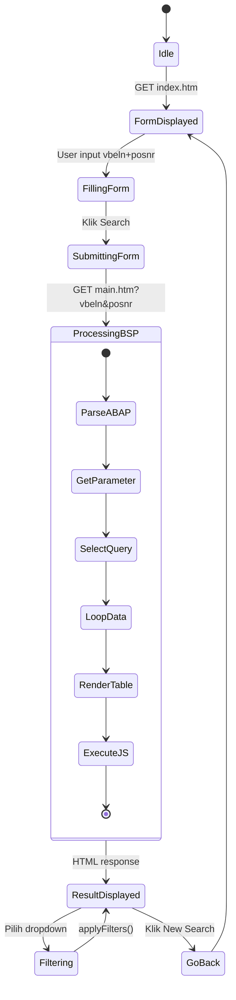

---

## 10. Activity Diagram — Report Path

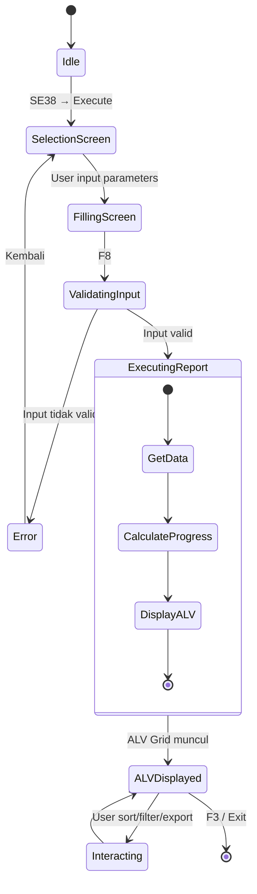

---

## 11. State Diagram — Halaman main.htm

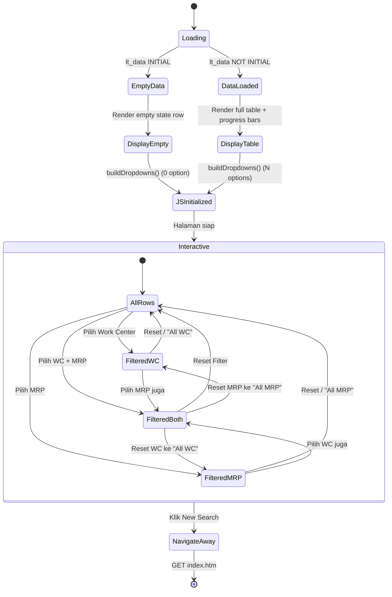

---

## 12. Timeline — Request/Response Lifecycle

### BSP Path — Timing Diagram

```
index.htm                          main.htm
   │                                  │
   ├── [t=0] User request index.htm  │
   ├── [t=1] Server parse (no ABAP)  │
   ├── [t=2] Render HTML + CSS       │
   ├── [t=3] HTTP Response           │
   │◄─────────────────────────────────┤
   │                                  │
   ├── [t=4] Browser display form    │
   ├── [t=5] User input + submit     │
   │                                  │
   │   GET ?vbeln=&posnr=            │
   ├─────────────────────────────────►│
   │                                  ├── [t=6] BSP Runtime parsing
   │                                  ├── [t=7] request->get_form_field
   │                                  ├── [t=8] SELECT + 5 JOIN
   │                                  ├── [t=9] LOOP + progress calc
   │                                  ├── [t=10] Render HTML + table
   │                                  ├── [t=11] Embed JS
   │                                  ├── [t=12] HTTP Response
   │◄─────────────────────────────────┤
   │                                  │
   ├── [t=13] Browser render table   │
   ├── [t=14] onload → buildDropdowns│
   ├── [t=15] Interactive            │
```

### Report Path — Timing Diagram

```
ZMON_CNC_KMI2
   │
   ├── [t=0] SE38 → Execute
   ├── [t=1] LOAD-OF-PROGRAM
   ├── [t=2] INITIALIZATION
   ├── [t=3] Selection Screen PBO
   ├── [t=4] Display screen → User input
   ├── [t=5] F8 → PAI
   ├── [t=6] START-OF-SELECTION
   ├── [t=7] get_data() → SELECT
   ├── [t=8] calculate_progress() → LOOP
   ├── [t=9] display_alv() → SALV
   ├── [t=10] ALV Grid displayed
   ├── [t=11] User interacts (sort/filter)
   ├── [t=12] F3 → END-OF-SELECTION
   └── [t=13] Program end
```

---

## Index Flowchart

| Diagram | Halaman | Deskripsi |
|---------|---------|-----------|
| 1 | [Sistem Utama](#1-flowchart-sistem-utama) | Percabangan BSP vs Report dari awal hingga akhir |
| 2 | [index.htm](#2-flowchart-bsp--indexhtm) | Form pencarian dan submit flow |
| 3a | [main.htm ABAP](#3a-abap-processing-phase) | Server-side ABAP processing |
| 3b | [main.htm HTML+JS](#3b-html--css--js-rendering-phase) | Client-side rendering |
| 3c | [main.htm Interaksi](#3c-user-interaction-post-render) | User action setelah load |
| 4a | [Report Lifecycle](#4a-report-lifecycle-penuh) | Full ABAP report lifecycle |
| 4b | [get_data](#4b-form-get_data-detail) | Detail form get_data |
| 4c | [calculate_progress](#4c-form-calculate_progress-detail) | Detail form calculate_progress |
| 4d | [display_alv](#4d-form-display_alv-detail) | Detail form display_alv |
| 5a | [Query Plan](#5a-query-execution-plan) | Database query execution |
| 5b | [DFD Level 0](#5b-data-flow-diagram-dfd-level-0) | Data flow diagram |
| 5c | [DFD Level 1](#5c-data-flow-diagram-dfd-level-1--proses-query) | Data flow detail query |
| 6 | [Progress Bar](#6-flowchart-progress-bar-logic) | Progress bar classification |
| 7a | [buildDropdowns](#7a-builddropdowns--initialization) | JS init function |
| 7b | [applyFilters](#7b-applyfilters--execution) | JS filter function |
| 7c | [resetFilters](#7c-resetfilters--execution) | JS reset function |
| 8 | [Error Handling](#8-flowchart-error-handling) | Semua skenario error |
| 9 | [Activity BSP](#9-activity-diagram--bsp-path) | State machine BSP |
| 10 | [Activity Report](#10-activity-diagram--report-path) | State machine Report |
| 11 | [State main.htm](#11-state-diagram--halaman-mainhtm) | UI state diagram |
| 12 | [Timeline](#12-timeline--requestresponse-lifecycle) | Request/response timing |
