# Flowchart Aplikasi Central Storage Production Dashboard

## 1. Flow Aplikasi Keseluruhan

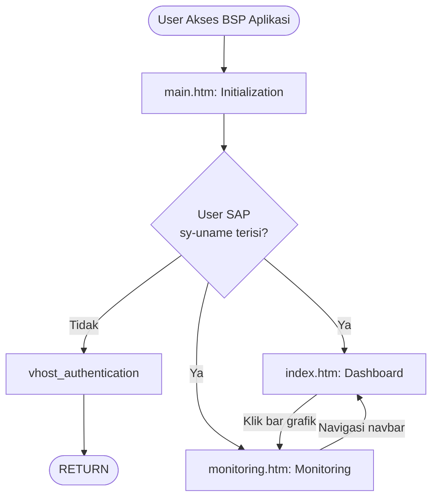

---

## 2. Flow Dashboard — index.htm

```mermaid
flowchart TD
    StartIdx([Load index.htm]) --> A[Set sy-uname]
    A --> B[Request form field 'period']
    
    B --> C{period = ?}
    C -- "='7'" --> C7[7 Hari Terakhir]
    C -- "='90'" --> C90[90 Hari Terakhir]
    C -- else (default) --> C30[30 Hari Terakhir]
    
    C7 & C30 & C90 --> D[Hitung lv_dfrom = sy-datum - days,\nlv_dto = sy-datum]
    
    D --> E1["Query 1: SELECT 10 SO terbaru\nFROM vbak → lt_recent\nSORT DESC, DELETE from 11"]
    E1 --> E2["Query 2: SELECT vbeln, erdat,\nkunnr, auart FROM vbak → lt_vbak"]
    E2 --> F{lt_vbak IS NOT INITIAL?}
    
    F -- Tidak (data kosong) --> SkipQ[Lewati semua query item]
    F -- Ya --> G[SELECT vbeln, posnr\nFROM vbap WHERE werks='2000'\nFOR ALL ENTRIES → lt_vbap]
    
    G --> H["Prune lt_vbak:\nHapus SO tanpa item Plant 2000"]
    H --> I[Hitung lv_total_so, lv_total_item]
    I --> J{lt_vbap IS NOT INITIAL?}
    
    J -- Tidak --> SkipAFPO
    J -- Ya --> K[SELECT kdauf, kdpos, psmng, wemng\nFROM afpo FOR ALL ENTRIES → lt_afpo]
    
    K --> L[LOOP lt_vbap → klasifikasi item]
    SkipAFPO --> L
    
    L --> M{Klasifikasi Item:\nREAD afpo + sy-subrc=0\nAND psmng > 0?}
    
    M -- Tidak → ELSE --> N3[noprod += 1\nlv_is_done = 3]
    M -- Ya --> N{pct = wemng/psmng*100\npct >= 100?}
    N -- Ya --> N1[done += 1\nlv_is_done = 1]
    N -- Tidak --> N2[inprog += 1\nlv_is_done = 2]
    
    N1 & N2 & N3 --> O[READ/MODIFY/APPEND\nke lt_so_prog per SO]
    O --> P["Hitung per-SO rate:\nrate = done/total*100"]

    P --> Q["Hitung overall rate:\nlv_rate = lv_done/lv_total_item*100"]
    
    Q --> R["Agregasi Mingguan:\nLOOP lt_vbak → lt_mth"]
    R --> SkipQ
    
    SkipQ --> S[Penentuan KPI Threshold]
    
    S --> T{lv_total_item = 0?}
    T -- Ya --> TGray["warna: gray\ntidak ada alert"]

    T -- Tidak --> U{lv_rate >= 80?}
    U -- Ya --> TGreen["warna: hijau\ntidak ada alert"]

    U -- Tidak --> V{lv_rate >= 50?}
    V -- Ya --> TAmber["warna: amber\nalert: perhatian"]
    V -- Tidak --> TRed["warna: merah\nalert: KRITIS"]
    
    TGray & TGreen & TAmber & TRed --> W["Build JSON arrays:\nlv_jmonths, lv_jdone, dll."]
    
    W --> X[RENDER HTML + CHART JS]
    
    X --> Y{Ada bar chart data?}
    Y -- Ya --> Z[Draw bar chart + donut chart\nHapus skeleton loading]
    Y -- Tidak --> Z2[Draw empty state charts\nHapus skeleton loading]
    
    Z & Z2 --> Z3["Bar chart click -> drillDown()"]
    
    Z3 --> AA["Jika klik bar minggu ke-n:\nRedirect ke monitoring.htm\ndengan filter tanggal minggu tersebut"]
```

### Detail Sub-Flow: Klasifikasi Item

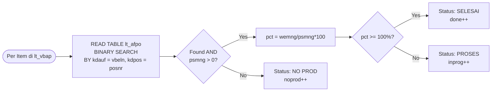

### Detail Sub-Flow: Agregasi Mingguan

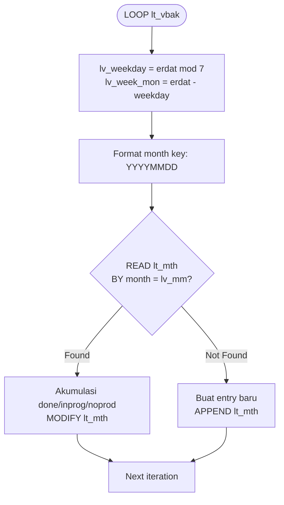

### Detail Sub-Flow: 5 SO Paling Lambat (Rendering)

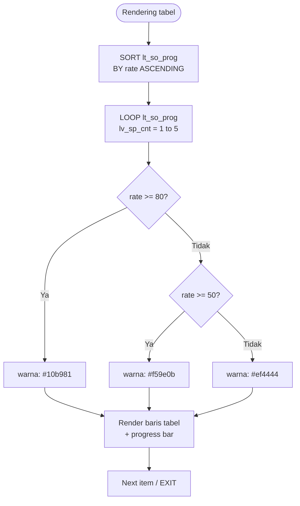

---

## 3. Flow Monitoring — monitoring.htm

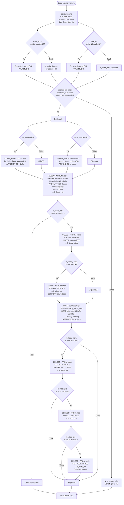

### Detail Sub-Flow: Item Progress Bar

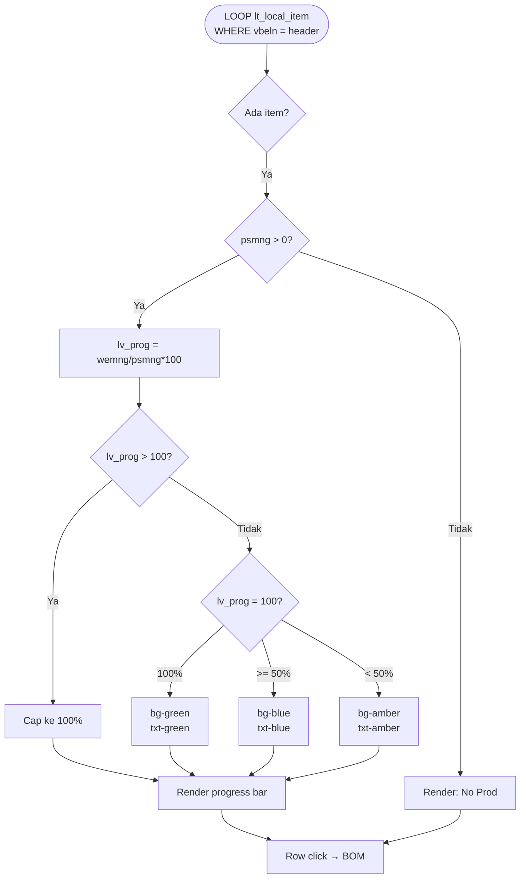

### Detail Sub-Flow: BOM Expandable

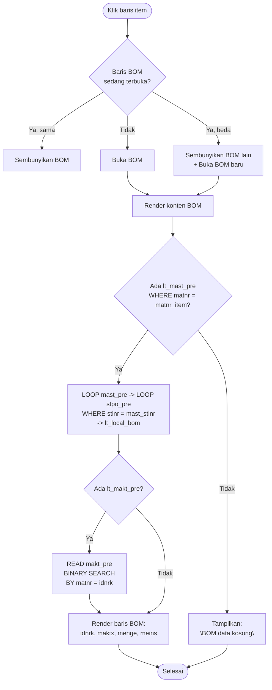

### Detail Sub-Flow: Pagination (Frontend JS)

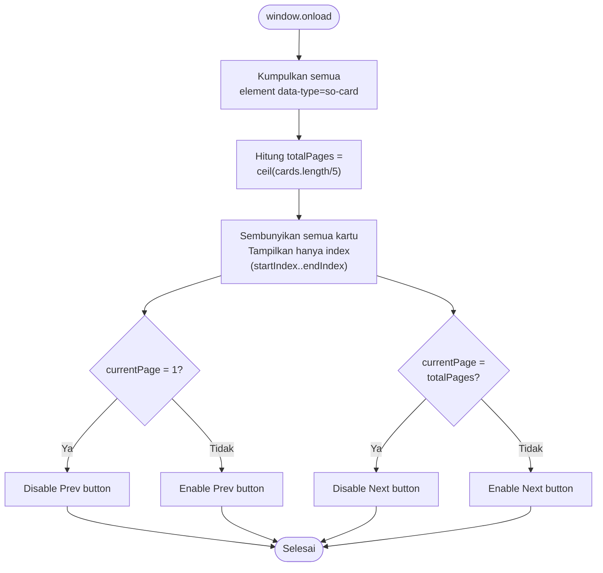

---

## 4. Flow Navigasi Antar Halaman

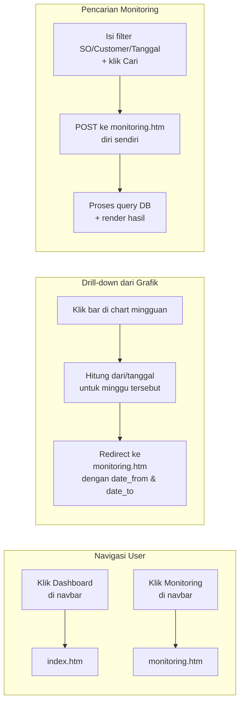

---

## 5. Flow Data & Dependency Antar Tabel SAP

```mermaid
flowchart TD
    subgraph TabelSAP["Tabel SAP"]
        VBAK["VBAK\nSales Order Header"]
        VBAP["VBAP\nSales Order Item"]
        AFPO["AFPO\nOrder Produksi"]
        MAST["MAST\nBOM Link"]
        STPO["STPO\nBOM Item"]
        MAKT["MAKT\nMaterial Description"]
    end
    
    subgraph Index["index.htm"]
        Q1["Query 1:\n10 SO terbaru"] --> VBAK
        Q2["Query 2:\nVBAK by date range"] --> VBAK
        Q3["VBAP by VBAK\nwerks=2000"] --> VBAP
        Q4["AFPO by VBAP\nkdauf, kdpos"] --> AFPO
    end
    
    subgraph Monitoring["monitoring.htm"]
        QM1["VBAK by filter"] --> VBAK
        QM2["VBAP by VBAK\nwerks=2000"] --> VBAP
        QM3["AFPO by VBAP"] --> AFPO
        QM4["MAST by VBAP.matnr\nwerks=2000"] --> MAST
        QM5["STPO by MAST.stlnr"] --> STPO
        QM6["MAKT by STPO.idnrk"] --> MAKT
    end
    
    subgraph Output["Output"]
        idx["Dashboard:\nKPI + Grafik +\nTabel SO"]
        mon["Halaman Monitoring:\nFilter + Detail Item + BOM"]
    end
    
    Q1 & Q2 & Q3 & Q4 --> idx
    QM1 & QM2 & QM3 & QM4 & QM5 & QM6 --> mon
```

---

## 6. Flow Error / Edge Cases

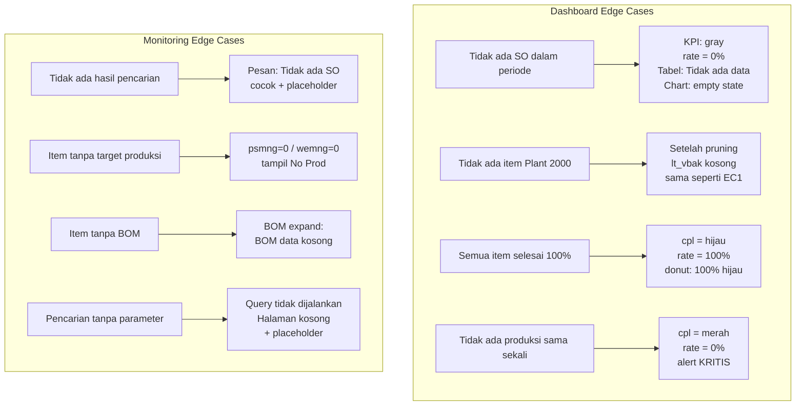
