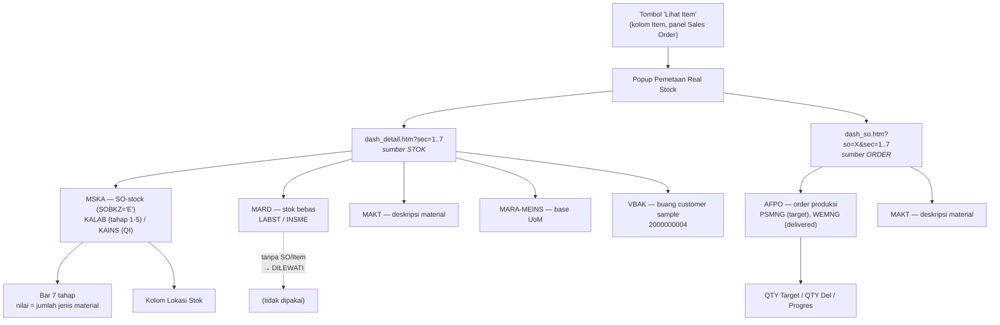

# Popup "Lihat Item" — Pemetaan Real Stock per SO Item

Dokumentasi asal data popup pada kolom **Item** di panel *Sales Order*
(`ZBSP_CS_APP/Page with Flow Logic/index.htm`).

Popup ini **murni sisi klien** — tidak ada endpoint/objek ABAP baru. Seluruh
datanya dirakit di browser dari dua endpoint BSP yang sudah ada sebelumnya.

---

## 1. Ringkasan alur data



**Catatan penting:** baris MARD (stok bebas) tidak punya SO/Item, dan kode
melewati baris tanpa item — jadi material dari sisi stok efektif berasal dari
**MSKA saja**.

---

## 2. Bar 7 tahap (baris item)

| Tahap | Plant | SLoc | Field stok |
|---|---|---|---|
| Bahan | 1000 | 1D00 | `MSKA-KALAB` |
| Central | 2000 | 2KCS | `MSKA-KALAB` |
| Machining | 2000 | 2261, 2262 | `MSKA-KALAB` |
| Banding | 2000 | 22E2, 22E3 | `MSKA-KALAB` |
| Sanding | 2000 | 229K | `MSKA-KALAB` |
| QI 1000 | 1000 | 1D00 | `MSKA-KAINS` |
| QI 2000 | 2000 | 2KCS..229K | `MSKA-KAINS` |

Angka pada kotak = **jumlah jenis material** yang berstok di tahap itu —
sengaja **tanpa UoM**, karena satu tahap bisa memuat material dengan satuan
berbeda (PC, KG) yang tidak boleh dijumlahkan. Qty per material tetap terbaca di
tooltip dan di rincian expand.

Item yang ditampilkan = **gabungan** item yang punya stok (MSKA) dan item yang
punya order (AFPO), sehingga tidak ada yang tersembunyi.

---

## 3. Kolom rincian (saat baris item diklik)

### Material

Gabungan dua populasi, dicocokkan berdasarkan nomor material:

| Sumber | Endpoint | Field |
|---|---|---|
| Stok | `dash_detail.htm` | `matnr`, `maktx` ← MSKA + MAKT |
| Order | `dash_so.htm` | `matnr`, `maktx` ← AFPO-MATNR + MAKT |

Penggabungan aman karena **kedua endpoint memformat MATNR dengan
`CONVERSION_EXIT_MATN1_OUTPUT` yang sama** (sudah diverifikasi), sehingga string
nomor materialnya identik.

### Lokasi Stok

Dirakit di browser, bukan dikirim server: untuk setiap tahap yang materialnya
berstok → `"<nama tahap> <qty>"`, digabung dengan `·`.
Qty = `MSKA-KALAB` (atau `KAINS` di QI), dalam base UoM `MARA-MEINS`.

Kolom ini **menampilkan UoM** — berbeda dari kotak bar — karena per material per
lokasi satuannya tunggal dan tidak ambigu.

> **Keterbatasan:** yang tampil adalah **nama tahap, bukan SLoc sebenarnya**.
> Untuk Machining (2261/2262), Banding (22E2/22E3), dan QI 2000 (2KCS..229K)
> tidak bisa dibedakan SLoc mana. Field `lgort` sudah tersedia di data dan bisa
> ditampilkan bila diperlukan.

### QTY Target, QTY Del, Progres

| Kolom | Asal |
|---|---|
| QTY Target | Σ **AFPO-PSMNG** seluruh order untuk (SO Item + material) |
| QTY Del | Σ **AFPO-WEMNG** (qty hasil goods receipt) |
| Progres | Σ WEMNG ÷ Σ PSMNG × 100, dibatasi 0–100 |

Dijumlahkan antar order karena satu material bisa punya beberapa order; aman
sebab base UoM satu material konstan. UoM dibuang agar konsisten dengan bar.

Penanda khusus:

| Kondisi | Tampilan |
|---|---|
| Material punya stok, tanpa order | Target/Del `—`, progres `tanpa order` |
| Material punya order, stok habis | Lokasi Stok `tanpa stok`, progres tetap dihitung |
| `PSMNG = 0` | progres `tanpa order` (tidak ada pembagian nol) |

---

## 4. ⚠️ Masalah terbuka: QTY Target/Del berpeluang kosong

`dash_so.htm` menyaring AFPO dengan:

```abap
WHERE kdauf = lv_so
  AND pwerk = lv_werks
  AND lgort IN lt_lg.     " <-- sumber masalah
```

Namun komentar di `dash_mrp.htm` menyatakan — dan itulah alasan file tersebut
mencari SLoc lewat MSEG mvt 101 alih-alih AFPO:

> `AFPO-LGORT` dipakai fallback saja krn utk order WM/PN umumnya **kosong**.

Order dengan `LGORT` kosong **tidak lolos filter di sec mana pun**.

Sebagai pembanding, query progres di `dash_cs.htm` — logika acuan dashboard ini —
menyaring AFPO **hanya** lewat MRP Controller, tanpa `pwerk`/`lgort`:

```abap
WHERE a~kdauf = ... AND a~kdpos = ...
  AND k~dispo IN ( 'WM1', 'WM2', 'PN1', 'PN2' )
  AND a~psmng > 0.
```

**Konsekuensi:** QTY Target dan QTY Del berpeluang besar tampil `—` di data
produksi, justru untuk order PNL/Moulding yang paling relevan. Uji otomatis
lulus karena datanya sintetis; ini kelemahan **sumber data**, bukan kode.

### Cara memastikan

Buka popup di SAP untuk satu SO yang diketahui punya order produksi. Bila
seluruh QTY Target/Del berisi `—`, dugaan ini terkonfirmasi.

### Opsi perbaikan

| Opsi | Isi | Konsekuensi |
|---|---|---|
| **1. Endpoint ABAP baru** (disarankan) | Meniru query `dash_cs.htm`: DISPO WM/PN, tanpa filter `lgort`, semua order (selesai + belum) | Satu-satunya opsi benar & lengkap; perlu objek BSP baru + aktivasi SE80 |
| 2. Pakai `dash_mrp.htm` | Berbasis DISPO, tanpa filter `lgort` | Hanya order `WEMNG < PSMNG`; material 100% hilang, progres tak pernah capai 100% |
| 3. Biarkan | — | Target/Del hanya terisi bila `AFPO-LGORT` memang terisi |

---

## 5. Caching

| Data | Cakupan cache | TTL |
|---|---|---|
| `dash_detail.htm` sec 1..7 | global (semua SO) | 120 dtk |
| `dash_so.htm` sec 1..7 | per SO | 120 dtk |

Popup pertama menembak 14 request (7 + 7); membuka popup SO yang sama lagi
dalam TTL tidak menembak request baru. Ada penjaga *in-flight* agar dua popup
beruntun tidak menggandakan request.

Bila satu bagian gagal dimuat, sisanya tetap ditampilkan disertai peringatan
bahwa angkanya mungkin belum lengkap — bukan mengosongkan seluruh pemetaan.

> Request pertama mengunduh seluruh material dari ketujuh bagian, jadi popup
> pertama akan terasa lambat. Bila terlalu berat di data produksi, endpoint ABAP
> khusus (`dash_stockmap.htm?so=X`) adalah obatnya.

---

## 6. Status verifikasi

| Aspek | Status |
|---|---|
| Logika render & agregasi | 35 uji otomatis lulus (data sintetis, fungsi diekstrak langsung dari `index.htm`) |
| Sintaks JS | `node --check` lolos |
| Format MATNR kedua endpoint | Diverifikasi konsisten (`CONVERSION_EXIT_MATN1_OUTPUT`) |
| Tampilan & data nyata di SAP | **Belum diuji** — perlu upload `index.htm` lalu buka popup |
| Ketersediaan QTY Target/Del di produksi | **Belum diuji** — lihat bagian 4 |
